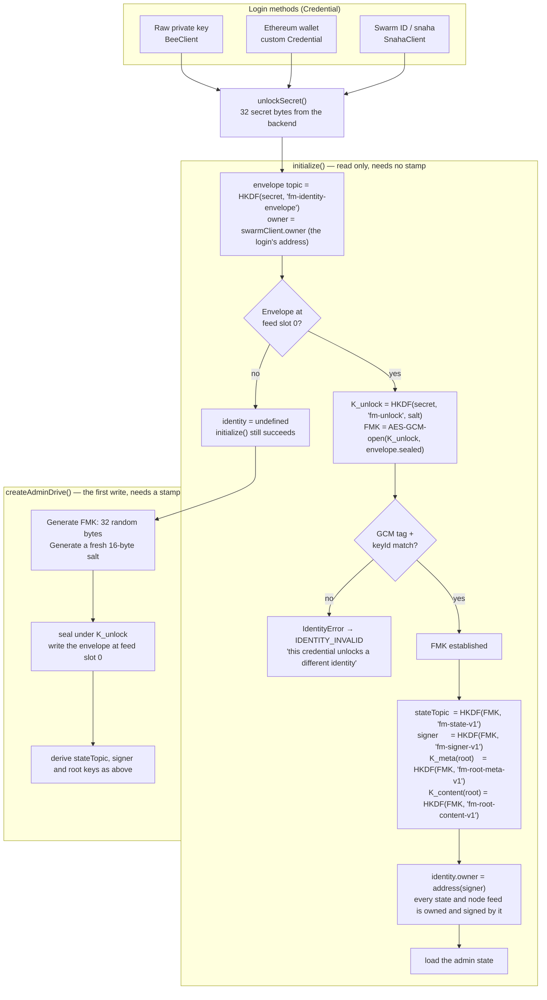
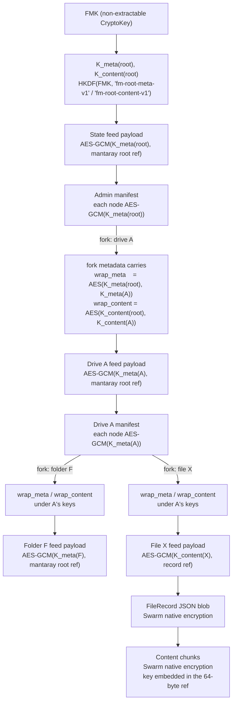
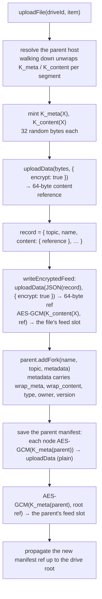
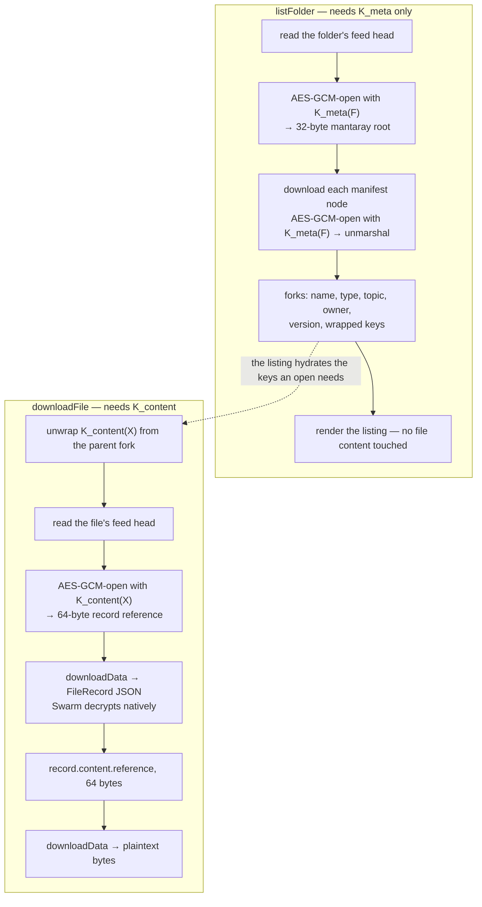
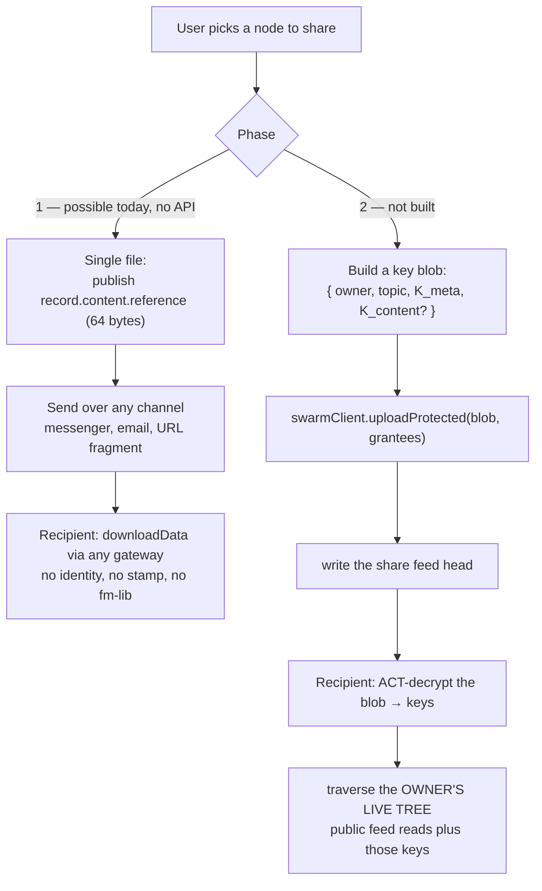

# Encryption and access control

How **@solarpunkltd/file-manager-lib** protects your data on Swarm. See [README.md](README.md) for the architecture
overview and [REFERENCE.md](REFERENCE.md) for the API surface.

Swarm is a public network: every chunk anyone uploads is retrievable by anyone who learns its address. This document
describes what the library encrypts, with which key, and what an observer can still see.

---

## 1. The model in one paragraph

**File content** is uploaded with **Swarm native encryption**, so Bee generates a random key per object and returns it
embedded in a 64-byte reference — the library never chooses or stores a content key. Those references live in the
**index** (feed payloads and mantaray manifests), and the index is encrypted **client-side** with AES-256-GCM under keys
the library does control. Every node — drive, folder or file — carries two keys: `K_meta` unlocks its listing and
`K_content` unlocks its content pointer. Each is wrapped under its parent's corresponding key, so the tree carries two
parallel key chains rooted in one **FileManager Key (FMK)**. All of it hangs off a single sealed envelope that turns a
login into that FMK.

Consequences worth stating up front:

- **A reference is a capability.** A 64-byte Swarm reference is `address ‖ key`; anyone holding one can read those
  bytes, forever. Encryption gates who can _learn_ a reference, never who can use one they already have.
- **Nothing is deleted.** Swarm has no delete. Removing a node from a manifest drops the reference; the chunks stay
  until their stamp expires.
- **The keys live in memory only.** They are recovered by walking the tree from the FMK downwards, never persisted
  client-side and never carried on a record.

---

## 2. Identity — from a login to the FileManager Key

Three login paths converge on one **FMK**: 32 random bytes minted once, sealed under a key derived from the login's own
secret, and stored in a feed under the **login's** address. It is the root of all index encryption, and separating it
from the login is what makes a user's drives reachable from more than one credential.



### Two addressing layers

A Swarm feed is addressed by the **pair** _(topic, owner address)_, and the library deliberately uses two different
owners:

| Layer         | Owner                           | Signed by             | Holds                                           |
| ------------- | ------------------------------- | --------------------- | ----------------------------------------------- |
| Envelope feed | `swarmClient.owner` — the login | the backend's own key | the sealed FMK                                  |
| Everything    | `identity.owner` — FMK-derived  | `identity.signer`     | the state feed and every drive/folder/file feed |

The envelope must live under the login's address: it has to be findable _before_ the FMK exists, and only the login can
sign a write there. Everything else must not, because otherwise two credentials sharing one FMK would derive the same
topics, look under two different owners, and find two disjoint trees — same identity, no shared data.

`identity.signer` is the one secret the library holds as raw bytes: secp256k1 is outside WebCrypto, so a client-side
feed signer cannot be a non-extractable `CryptoKey`. It sits on the internal `Identity` and is deliberately absent from
the public `IdentityInfo`. It is also the single exception to the port's "no key material crosses the boundary" rule —
`writeFeed` takes it as `options.signer`. That key is fm-lib's own, never the backend's; on Swarm ID it reaches an
iframe that already holds the master key it descends from, so no party is added to the trust boundary.

### The envelope

```jsonc
{
  "v": 1, // KDF epoch — bumping it orphans every existing identity
  "salt": "…", // 16 public bytes, fresh per envelope
  "sealed": "…", // iv ‖ AES-256-GCM(K_unlock, FMK)
  "keyId": "…", // HKDF(FMK, 'fm-key-id-v1', salt)
}
```

- **Written at feed index 0, never appended to.** Nothing about an envelope rotates in place — a changed unlock secret
  lands on a different topic, a joining credential writes under its own address, and re-keying the FMK is a new
  identity. Since nothing appends, slot 0 is the accurate read, and it collapses Bee's latest-update lookup into one
  addressed chunk fetch on the path every session start runs through. Bee answers a _missing_ chunk with a 500 rather
  than a 404, so a first login falls back to a feed-head read, which reports an empty feed properly. **Never append to
  this feed:** Bee silently no-ops on a taken index, so a slot-1 envelope would be written successfully and then be
  invisible to every reader.
- **AES-GCM's authentication tag is the verifier.** A wrong unlock key fails decryption outright, so no separate
  verifier is stored. `keyId` is the narrower check that the envelope belongs to this FMK rather than a foreign one.
  Together they turn a non-deterministic signer into a loud `IdentityError` instead of a silently empty drive list — the
  mitigation for wallets that do not implement RFC 6979.
- **`keyId` is salted with the envelope's own salt.** It is the one FMK-derived value written to the wire in the clear,
  so an unsalted fingerprint would be byte-identical in every envelope sealing that FMK. Once a second credential can
  join an identity, anyone able to read both envelopes could link that user's login addresses — the exact correlation
  the two-layer split exists to avoid. Salting costs nothing, since the salt is already in the envelope.
- **The topic is derived, not fixed.** `HKDF(unlockSecret, 'fm-identity-envelope')`, unsalted — the salt lives inside
  the envelope, so it cannot address it. A fixed public topic would let anyone who knows an address see whether an
  identity exists there, and let someone sweep addresses for envelopes to correlate their `keyId`s. Deriving the topic
  removes the enumeration primitive rather than hardening what it finds.
- **Locating and opening the envelope share one `unlockSecret()` call.** A wallet-backed credential signs to produce it,
  and a second call would put a second signature prompt in front of the user on every startup. The secret is zeroed once
  the operation completes.

### The `Credential` seam

`Credential` carries exactly one method — `unlockSecret(): Promise<Uint8Array>`. It does not carry an owner, because the
envelope's location is the client's address and nothing else can be.

```ts
const fm = new FileManagerBase(swarmClient, undefined, {
  credential: { unlockSecret: () => deriveFromWalletSignature() },
});
```

Two requirements a backend or a custom credential **must** meet, both of which compile and pass tests when violated:

1. **The secret must be byte-stable** for a given user across sessions and devices. A different value derives a
   different unlock key, and the identity stops unsealing.
2. **The secret must be private to the backend.** Hashing a public value — an address, a public key — leaves the
   envelope openable by anyone who can read it, which is a total compromise rather than a metadata leak: recovering the
   FMK yields `identity.signer` and write access to every drive. `SwarmClient.deriveSecret` documents this as an
   explicit contract; `SnahaClient` delegates to `@snaha/swarm-id`'s `deriveAppSecret`, which computes
   `HMAC(appSecret, label)` inside the trusted iframe.

### Resolve and provision are separate phases

`initialize()` only reads, so a newcomer with no stamp still initializes successfully and lands on
`identity === undefined` — a normal first-run state, not an error. The FMK is minted on the first write that needs it,
`createAdminDrive`, because writing the envelope costs a stamp.

---

## 3. The key hierarchy



The invariant: **folder and drive feed payloads are meta-keyed; file feed payloads are content-keyed.** Walking the tree
needs `K_meta`. Opening a leaf needs `K_content`. That single asymmetry is what makes "list a folder without being able
to open its files" expressible — the basis of the share grades in §7.

Node keys are 32 random bytes each, minted when the node is created and stored **only** as a wrapped pair in the
parent's fork metadata:

| Metadata key                | Constant                                | Holds                                               |
| --------------------------- | --------------------------------------- | --------------------------------------------------- |
| `swarm-wrapped-meta-key`    | `MANIFEST_METADATA_WRAPPED_META_KEY`    | `iv ‖ AES-GCM(K_meta(parent), K_meta(child))`       |
| `swarm-wrapped-content-key` | `MANIFEST_METADATA_WRAPPED_CONTENT_KEY` | `iv ‖ AES-GCM(K_content(parent), K_content(child))` |

Root keys are raw bytes rather than a non-extractable `CryptoKey`, because every node key below the root is wrapped into
a manifest and — once sharing lands — handed to a grantee, so none of them can be non-extractable. The FMK itself stays
non-extractable; what sits in the heap is one generation below it.

---

## 4. What is encrypted, and how

| Object                | Encrypted by                   | Under                   | On the wire                                |
| --------------------- | ------------------------------ | ----------------------- | ------------------------------------------ |
| File content chunks   | Swarm native (`encrypt: true`) | a random per-object key | 64-byte reference carries the key          |
| `FileRecord` JSON     | Swarm native (`encrypt: true`) | a random per-object key | 64-byte reference carries the key          |
| File feed payload     | fm-lib, AES-256-GCM            | `K_content(file)`       | ~92 bytes: `iv ‖ sealed(64-byte ref)`      |
| Manifest chunks       | fm-lib, AES-256-GCM            | `K_meta(host)`          | plain upload of sealed bytes, 32-byte refs |
| Manifest feed payload | fm-lib, AES-256-GCM            | `K_meta(host)`          | ~60 bytes: `iv ‖ sealed(32-byte ref)`      |
| Identity envelope     | fm-lib, AES-256-GCM            | `K_unlock`              | JSON in the feed slot                      |
| Fork metadata         | not encrypted                  | —                       | names, types, versions, wrapped keys       |

All fm-lib encryption is AES-256-GCM via `globalThis.crypto.subtle`, available in the browser and in Node ≥ 22 — which
`engines.node` already requires, so this adds no dependency. Every ciphertext the library produces is `iv ‖ ciphertext`
with a 12-byte IV; the GCM tag is part of the ciphertext.

### A feed payload is one sealed reference — and nothing else

Not JSON, and not a sealed _payload_ whose reference is then published. The distinction is easy to get backwards, and it
matters: a 64-byte Swarm reference is `address ‖ key`, so the reference **is** the capability. Sealing the payload and
publishing the reference protects nothing that sealing the reference doesn't, costs AES over the whole payload instead
of over 64 bytes, and makes native encryption dead weight, since the key it generated would be published in the clear
beside the address. **Seal the reference; let Swarm encrypt the bytes.**

Sealing only the key half of a 64-byte reference would be equally secure — the address alone yields ciphertext — but
sealing all 64 costs 32 bytes and additionally hides _which chunk_ a feed points at, so an observer cannot correlate a
feed to a chunk.

Two writers follow from payload size:

- **`writeSealedRefFeed`** — the reference already exists (every manifest root, which is 32 bytes). No blob, no extra
  round trip: the sealed root goes straight into the feed slot.
- **`writeEncryptedFeed`** — the payload is unbounded (a `FileRecord`, whose `customMetadata` has no fixed size). It is
  uploaded natively encrypted first, and the returned 64-byte reference is then sealed by `writeSealedRefFeed`.

`openFeedRef` is the read side for both. It unseals and validates the result as a 32- or 64-byte reference, so a
mis-keyed read fails there with a clear error rather than as a puzzling 404 further down.

### Manifest chunks are sealed client-side, not natively encrypted

This is a deliberate exception, forced by mantaray's binary format. A marshaled node stores **one** reference-length
byte and applies it to its entry _and_ every fork. The library's fork targets are 32-byte **topics**, so a natively
encrypted manifest would mix a 32-byte entry with 64-byte fork addresses, and any node carrying both parses back wrong.
Such a node is not exotic — it is what mantaray builds whenever one entry name is a prefix of another (`report` beside
`report.pdf`, `a` beside `ab`). It throws at **read** time, on a manifest that was written successfully, so the damage
would already be durable when it surfaced.

Sealing the marshaled bytes ourselves and uploading them plain keeps every reference 32 bytes, removes the format risk
entirely, and puts the manifest key under our control instead of inside the reference. Native encryption is still used
everywhere it is unconstrained — file content, and the record blobs behind feed payloads — because those references are
never mantaray entries.

---

## 5. Read and write paths

### Uploading a file



### Listing and opening



### Keys are hydrated by walking, not by loading

The key chain is an in-memory cache populated as the tree is walked, alongside the manifest and feed-index caches.
Unwrapping happens **per entry, at the point of use** — each segment of a path descent, each header in a folder walk,
each drive in the registry — never as one eager pass over a whole manifest. That is deliberate: listing has a per-entry
failure model (`FailureScope.Entry` for a file, `FailureScope.Subtree` for a folder, `DRIVE_UNRESOLVED` for a drive),
and a batched unwrap would turn one bad fork into a failure of every sibling that happens to share its manifest.

**Reaching a node means having walked to it.** A `FileRecord` carries no key material, so a record held across a process
restart cannot be opened from the record alone. `updateFile`, `getFileVersion` and `restoreFileVersion` therefore
re-walk the record's `path` to recover its keys before touching the feed. That works whenever the record still carries a
valid path and the node is still where it says; otherwise the call fails with a `KeyringError` naming the node, rather
than returning an empty result. **List before you open** is the reliable pattern, and it is what an application does
anyway.

**Keys are never evicted on rotation.** Dropping a single node's caches (after a failed write, say) deliberately leaves
its keys in place — they are not recoverable once dropped, since the only other copy is wrapped in a parent manifest
that may no longer be reachable. Keys go away only on a full reset, which rebuilds them from the FMK.

### Relocation must re-wrap

A move, trash or recover across parents relocates a fork verbatim. The child's keys are sealed under the **old**
parent's keys, so a relocation without unwrap-then-re-wrap leaves an entry that appears in the listing and opens for
nobody. The library re-wraps on every cross-parent relocation; a same-parent move (a rename) shares the key and needs
nothing. Renaming a **drive** needs it too, for a less obvious reason: it rebuilds the drive's fork metadata from
scratch to change the name, which would drop the wrapped keys unless they are re-sealed alongside it.

---

## 6. What an observer can still see

Encryption is not anonymity. With no keys at all, someone who knows an address or holds a chunk can still observe:

- **That a feed exists and how often it updates**, if they can guess its topic. Topics are derived from secrets
  (`stateTopic` from the FMK, node topics minted at random), so guessing is the hard part — but an observer watching a
  known feed sees update cadence, and therefore activity.
- **The shape of a manifest chunk**: it is uploaded plain, so its size is visible. Its _contents_ — names, types,
  wrapped keys — are sealed.
- **The login's address**, from the envelope feed, if they know where to look. The envelope's topic is derived from a
  private secret, which is what makes sweeping for identities impractical.
- **Anything they have already dereferenced**, permanently. Swarm cannot unsee.

Under `BeeClient` the Bee node performs Swarm's native encryption, so the node operator sees file content in transit.
Client-side sealing of the index is unaffected by this — the node never holds `K_meta` or `K_content` — but content
confidentiality against the node operator is not something this design provides.

---

## 7. ACT and sharing

ACT (Swarm's Access Control Trie) is **not used by the tree**. It remains on the `SwarmClient` port — `uploadProtected`,
`downloadProtected`, `downloadProtectedStream`, `actPublisher` — as the **share layer's** API, and no library operation
calls it today.

The reason for narrowing it there rather than removing it: ACT is good at gating a small blob to a named grantee list.
It is a poor fit for a tree, where it costs one grant per node and scales with the size of what you share instead of
with the number of shares. Under the key chain, sharing means handing over keys — a payload of a few hundred bytes — so
one ACT write covers a subtree of any size.

**Sharing is not implemented.** The mechanism it will use is already in place; the delivery is not.



Phase 1 needs no library support for a single file: `record.content.reference` is a complete, self-contained capability
— the reference carries its own decryption key, which is exactly what makes publishing it a share. It is also
irrevocable, and it pins one version rather than tracking the file.

Share grades phase 2 will offer, all from the same mechanism:

| Hand over                            | The recipient can                                                   |
| ------------------------------------ | ------------------------------------------------------------------- |
| `K_meta(folder)`                     | full recursive listing — names, types, versions. No file contents.  |
| `K_meta` + `K_content(folder)`       | full read of the subtree, tracking future changes                   |
| `K_content(file)`                    | open that one file — equivalent to publishing its 64-byte reference |
| `K_meta(folder)` + `K_content(file)` | browse everything, open one thing                                   |

**Not supported, deliberately:** shallow listing (list a folder but not its subfolders). Neither UNIX nor Google Drive
offers it, and implementing it would mean breaking the `K_meta` chain at every subfolder boundary, turning one share
into N.

### Known limits on the sharing path

- **Rotation is the only revocation, and it denies future reads only.** Re-keying a subtree costs no content re-upload —
  the 64-byte content references are unchanged — but it does mean re-sealing a feed payload and re-wrapping child keys
  per node. Anything a recipient has already dereferenced is theirs permanently. Rotation is not implemented; when it
  is, it must be a resumable job with a persisted progress marker, because a half-rotated subtree leaves parents holding
  wrapped keys that no longer match their children, and because Bee silently no-ops on a taken feed index.
- **Cross-backend shares will not work.** ACT decryption is node-side on bee-js and iframe-side on Swarm ID, so a share
  created for a Swarm ID identity is unreadable by a `BeeClient` user, and vice versa.
- **Discovery is out of scope.** ACT gates who _can_ read a share; nothing announces that one exists.
- **Swarm ID has no ACT history continuity.** `actUploadData` takes no history parameter, so every protected write mints
  a fresh history and grantee list. Reads work; amending a grantee list in place does not.

---

## 8. Constants and labels

All HKDF `info` labels are versioned by a single **KDF epoch**. Bumping it re-derives the whole tree and orphans every
existing identity — it is not the package version, and a breaking API change does not belong there.

```ts
KDF_EPOCH = 1;
const label = (name: string) => `fm-${name}-v${KDF_EPOCH}`;

STATE_TOPIC_LABEL = 'fm-state-v1'; // stateTopic  = HKDF(FMK, …)
SIGNER_LABEL = 'fm-signer-v1'; // signer      = HKDF(FMK, …)
KEY_ID_LABEL = 'fm-key-id-v1'; // keyId       = HKDF(FMK, …, salt)
ROOT_META_KEY_LABEL = 'fm-root-meta-v1'; // K_meta(root)
ROOT_CONTENT_KEY_LABEL = 'fm-root-content-v1'; // K_content(root)

// Deliberately epoch-FREE — see below.
UNLOCK_KDF_LABEL = 'fm-unlock';
IDENTITY_ENVELOPE_TOPIC_LABEL = 'fm-identity-envelope';
```

The two envelope labels carry no epoch suffix on purpose. They **locate** the envelope, and an envelope that cannot be
found cannot be reported as outdated: a bumped epoch would move the topic, `initialize()` would read the miss as a first
run, and `createAdminDrive` would provision a second identity over a live one. The envelope's contents are versioned
instead, via its `v` field — which is rejected outright when it does not match the current epoch, so a version change
fails loudly rather than half-unsealing.

Other fixed values:

| Constant                       | Value | Meaning                                      |
| ------------------------------ | ----- | -------------------------------------------- |
| `FMK_LENGTH`                   | 32    | FileManager Key, in bytes                    |
| `UNLOCK_SALT_LENGTH`           | 16    | envelope salt, fresh per envelope            |
| `DERIVED_SECRET_LENGTH`        | 32    | every derived secret and AES key             |
| `GCM_IV_LENGTH`                | 12    | prefixed to every ciphertext                 |
| `IDENTITY_ENVELOPE_FEED_INDEX` | `0n`  | the envelope feed's only slot — never append |

---

## 9. Errors you will see

| Error           | Raised when                                                                                                                                                                                                                                                                                                                                                                                   |
| --------------- | --------------------------------------------------------------------------------------------------------------------------------------------------------------------------------------------------------------------------------------------------------------------------------------------------------------------------------------------------------------------------------------------- |
| `IdentityError` | the envelope will not unseal, its `keyId` belongs to another FMK, its version does not match the current epoch, or provisioning found one already there. `initialize()` reports it as `IDENTITY_INVALID` ahead of `INITIALIZED false`, so "sign in with the other credential" and "the node is unreachable" stay distinguishable. A **missing** envelope is not an error — it is a first run. |
| `KeyringError`  | a node's keys are not in the chain and cannot be recovered — the node was never walked to, or a fork carries no wrapped keys, or its wrapped keys do not unwrap under its parent (the manifest and the key chain disagree).                                                                                                                                                                   |

Both name the node they are about, truncated to its topic prefix.

Calling a public method before an identity exists is not one of these: readiness is checked first and raises
`DriveError('No identity — create an admin drive first')`, because to the caller it is the same class of problem as
calling before `initialize()`.

---

## 10. Not implemented

Listed here so the gaps are explicit rather than inferred:

- **Sharing (phase 2)** — the ACT delivery of key blobs, and every share grade in §7.
- **Phase 1 folder sharing** — snapshotting a subtree into a new plaintext manifest. The single-file case needs no API.
- **Key rotation** — including the resumable-job machinery it requires.
- **Linking a second credential to one identity.** The FMK-derived owner makes multi-login portability _possible_; it is
  not yet _reachable_. A second login finds no envelope under its own address and mints a fresh FMK — a second, disjoint
  identity. Joining means writing an envelope that seals the _same_ FMK under credential B's unlock key at B's address,
  which requires being signed in as B while holding the FMK; since the FMK is imported non-extractable and its source
  bytes are zeroed immediately, there is currently no export path. Whatever mechanism lands, **credential B's envelope
  must get a fresh salt** — reusing A's would make both envelopes carry a byte-identical `keyId` in the clear, publicly
  linking the two login addresses, which is the exact correlation salting `keyId` prevents.
- **Origin-independent identity on Swarm ID.** `deriveAppSecret` is scoped to `(identity, app origin)`, so the same user
  on two origins provisions two disjoint identities. This is the one remaining external dependency, and it is a
  portability limit rather than a security one.
