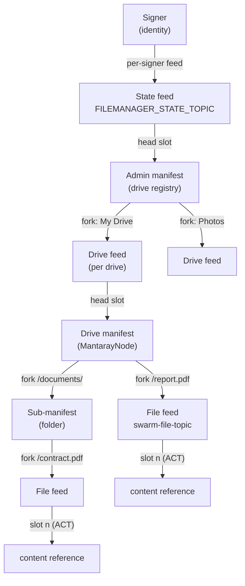

# File Manager Library

**@solarpunkltd/file-manager-lib** is a TypeScript/JavaScript library for storing and managing files, folders and drives
on [Swarm](https://ethersphere.github.io/swarm-home/). It builds on [Bee](https://github.com/ethersphere/bee-js) and
models a full, versioned, access-controlled filesystem on top of Swarm's content-addressed storage.

- **Drives** — named, stamp-backed volumes. Each drive is a Swarm-native
  [mantaray](https://docs.ethswarm.org/docs/develop/tools-and-features/manifest) manifest, not an opaque blob.
- **Folders** — real nested directories (sub-manifests), created, listed, moved and removed like on a UNIX filesystem.
- **Files** — each file is its own node with an independent feed carrying its full version history.
- **Access Control (ACT)** — every manifest root and file is ACT-wrapped; reads resolve via `actPublisher` + history
  address.
- **Versioning** — every structural change publishes a new feed slot, so drives, folders and files all gain automatic
  history. Restore any file version to head.
- **Trash / recover / forget** — soft-delete via an owner-private overlay, or hard-delete a node from the manifest.
- **Move** — relocate files and folders within or across drives.
- **Browser + Node.js** — one unified API; the byte source differs (`file` vs `sourcePath`).

> Full method-level documentation: see [REFERENCE.md](REFERENCE.md). Test coverage and usage patterns: see
> [tests/TESTS.md](tests/TESTS.md).

---

## How it works — a filesystem mirrored onto Swarm

The library maps a familiar UNIX-style filesystem onto Swarm primitives (feeds + mantaray manifests). Nothing about the
tree lives only in memory: every drive, folder and file is walkable on Swarm from a single per-signer feed.

### The structure

```
Signer (Ethereum identity)
└── state feed  (FILEMANAGER_STATE_TOPIC)         ← points to the drive registry
    └── admin manifest  (registry of all drives)
        ├── My Drive   ──▶ drive feed ──▶ drive manifest      ← a mounted volume
        │   ├── report.pdf         ──▶ file feed (v0, v1, …)  ← file (inode) + versions
        │   └── documents/         ──▶ sub-manifest           ← directory
        │       └── contract.pdf   ──▶ file feed (v0, v1, …)
        └── Photos     ──▶ drive feed ──▶ drive manifest
            └── 2024/  ──▶ sub-manifest
                └── trip.jpg        ──▶ file feed
```



### The UNIX mapping

| Swarm / mantaray primitive                   | UNIX filesystem analogue    | Role                                             |
| -------------------------------------------- | --------------------------- | ------------------------------------------------ |
| Signer (Ethereum identity)                   | volume owner                | Owns and signs the whole tree                    |
| State feed head (`FILEMANAGER_STATE_TOPIC`)  | root pointer                | Resolves the current drive registry              |
| Admin manifest                               | volume table (`/etc/fstab`) | Registry of all drives                           |
| Drive = mantaray under a per-drive feed      | mounted volume              | A named, stamp-backed collection                 |
| Folder = sub-manifest fork                   | directory (inode)           | Nested namespace                                 |
| File fork → per-file feed                    | file (inode) with history   | Stable identity + full version chain             |
| Fork metadata map (`swarm-node-*`)           | inode metadata              | Owner, type, version, ACT publisher, path        |
| New feed slot on every structural change     | filesystem snapshot         | Automatic drive/folder/file version history      |
| Trash overlay (owner-private admin metadata) | recycle bin / `.Trash`      | Soft-delete without mutating data or the subtree |

### Key design points

- **Files are addressed by feed topic, not content ref.** A file fork's target is the file's own feed topic. Changing a
  file's bytes writes a new slot in _its_ feed and never re-saves the drive manifest — the manifest only changes on
  structural edits (add / remove / move / rename).
- **Folders and drives are the same object at different levels.** A drive is a top-level mantaray; a folder is a nested
  one. The same walk/list/move logic works at every level.
- **Versioning is a side effect of content-addressing.** Because each structural change publishes a new feed slot, the
  whole tree gains history for free.
- **ACT everywhere.** Manifest roots and file content are ACT-wrapped on every save; per-file publishers stay
  independent via metadata.

---

## Installation

```bash
pnpm install @solarpunkltd/file-manager-lib
```

Requires **Node.js ≥ 22**. Peer dependency: `@ethersphere/bee-js`. The package ships dual **ESM + CJS** builds with
separate **Node** and **browser** bundles, selected automatically via `package.json` `exports` conditions — bundlers get
a `fs`/`path`-free browser build.

---

## Running a Bee Node

The library requires a running [Bee](https://github.com/ethersphere/bee) node with postage stamps available.

## Postage Stamps

You need an active postage stamp to upload data. The first stamp you dedicate becomes the **admin stamp** backing the
admin drive / state.

```bash
# install the CLI
pnpm install -g @ethersphere/swarm-cli

# list existing stamps
swarm-cli stamp list

# buy a new stamp
swarm-cli stamp buy --amount 100000000000 --depth 20 --label admin
```

---

## Quick Start

```ts
import { Bee } from '@ethersphere/bee-js';
import { FileManagerBase, ListDepth } from '@solarpunkltd/file-manager-lib';

// bee must be constructed with a signer
const bee = new Bee('http://localhost:1633', { signer });

// optional third arg: { uploadConcurrency?, feedFetchConcurrency? }
const fm = new FileManagerBase(bee);

// 1. rehydrate any existing state from Swarm
await fm.initialize();

// 2. FIRST-TIME SETUP ONLY: bootstrap the admin state + admin drive.
//    On later runs, initialize() alone restores everything — skip this.
const adminBatchId = 'your-admin-batch-id';
await fm.createAdminDrive(adminBatchId);

// 3. create a regular drive (needs its own stamp)
const drive = await fm.createDrive('my-drive-batch-id', 'My Drive');

// 4. upload files — folder hierarchy is recreated as real folder nodes
await fm.uploadFiles(
  drive.id,
  [
    { path: 'docs/readme.md', sourcePath: './readme.md' },
    { path: 'docs/img/logo.png', sourcePath: './logo.png' },
  ],
  '/', // destination folder within the drive
);

// 5. list the drive tree
const entries = await fm.listFolder(drive.id, '/', ListDepth.Deep);
console.log(entries.map((e) => `${e.type}: ${e.path}`));

// 6. download a file (ReadableStream in both Node and browser)
const record = fm.recordList.find((r) => r.path === 'docs/readme.md')!;
const { result } = await fm.downloadFile(record);

// 7. re-version, move, restore
const v0 = await fm.getFileVersion(record, '0');
await fm.restoreFileVersion(v0);
await fm.move('docs/readme.md', 'docs/README.md', drive.id);
```

### Node vs Browser

The only difference is the byte source for uploads and updates:

- **Node** — `{ path: 'in/drive.txt', sourcePath: '/abs/or/rel/on/disk.txt' }`
- **Browser** — `{ path: 'in/drive.txt', file: someFile /* a File */ }`

`downloadFile` / `downloadFiles` / `downloadFolder` return a `ReadableStream<Uint8Array>` per file in both environments.

### Tuning concurrency

Bee-facing fan-out is bounded and configurable through the constructor:

```ts
const fm = new FileManagerBase(bee, undefined, {
  uploadConcurrency: 4, // concurrent file uploads in uploadFiles (default 2)
  feedFetchConcurrency: 16, // concurrent feed reads during listing/versioning (default 10)
});
```

Both are clamped to a minimum of 1.

---

## Events

The FileManager emits `FileManagerEvents` on its `emitter`:

```ts
fm.emitter.on(FileManagerEvents.FILE_UPLOADED, ({ record }) => console.log('uploaded', record.path));
```

`INITIALIZED`, `STATE_INVALID`, `DRIVE_CREATED`, `DRIVE_FORGOTTEN`, `FILE_UPLOADED`, `FILES_UPLOADED`, `FILE_UPDATED`,
`FILE_DOWNLOADED`, `FILE_MOVED`, `FILE_TRASHED`, `FILE_RECOVERED`, `FILE_FORGOTTEN`, `FILE_VERSION_RESTORED`,
`FOLDER_CREATED`, `FOLDER_TRASHED`, `FOLDER_RECOVERED`, `FOLDER_FORGOTTEN`. See [REFERENCE.md](REFERENCE.md#events) for
when each fires.

---

## Scripts

From `package.json`:

- `pnpm run build` → bundle Node + browser (ESM + CJS) + type declarations via **tsup**.
- `pnpm run test` → run Jest tests (see [tests/TESTS.md](tests/TESTS.md)).
- `pnpm run lint` / `pnpm run lint:fix` → linting.
- `pnpm init:husky` → husky init.
- `pnpm run depcheck` → check dependencies.

---

## Troubleshooting

- **Admin stamp not found** → buy a new stamp and pass its batch id to `createAdminDrive`.
- **`admin state already exists`** → the state feed is already bootstrapped; call `initialize()` only, or pass
  `reset: true` to `createAdminDrive` to overwrite.
- **Source path does not exist / is a directory** → `uploadFile` takes a single file; use `uploadFiles` for trees.
- **Postage expired** → buy a new stamp and re-initialize.
- **ACT unwrap errors** → ensure the `FileRecord` carries a valid `actPublisher` and content history reference.

---

## License

[Apache-2.0](./LICENSE)
