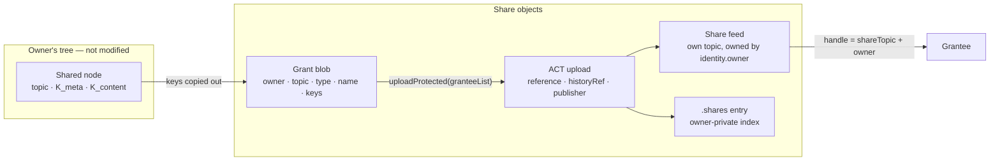
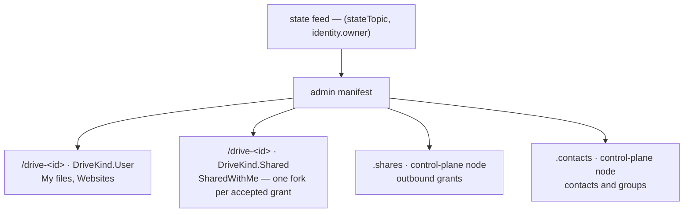
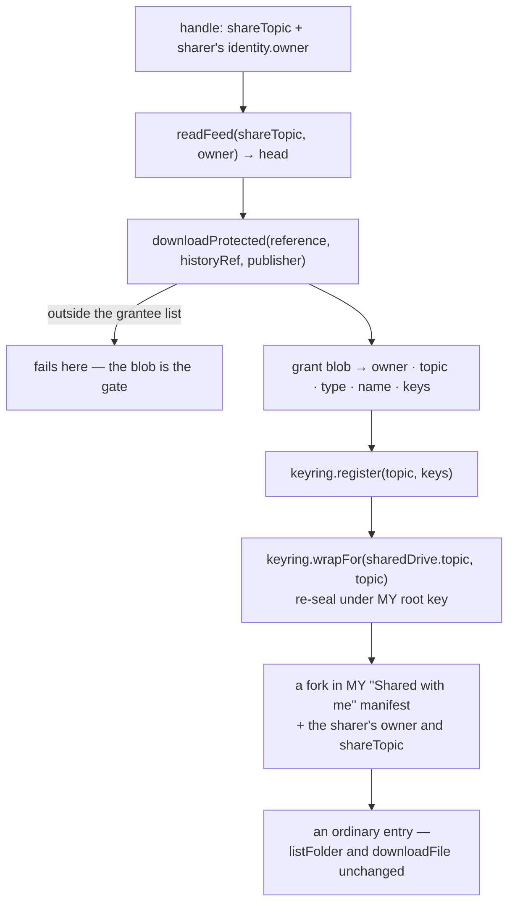
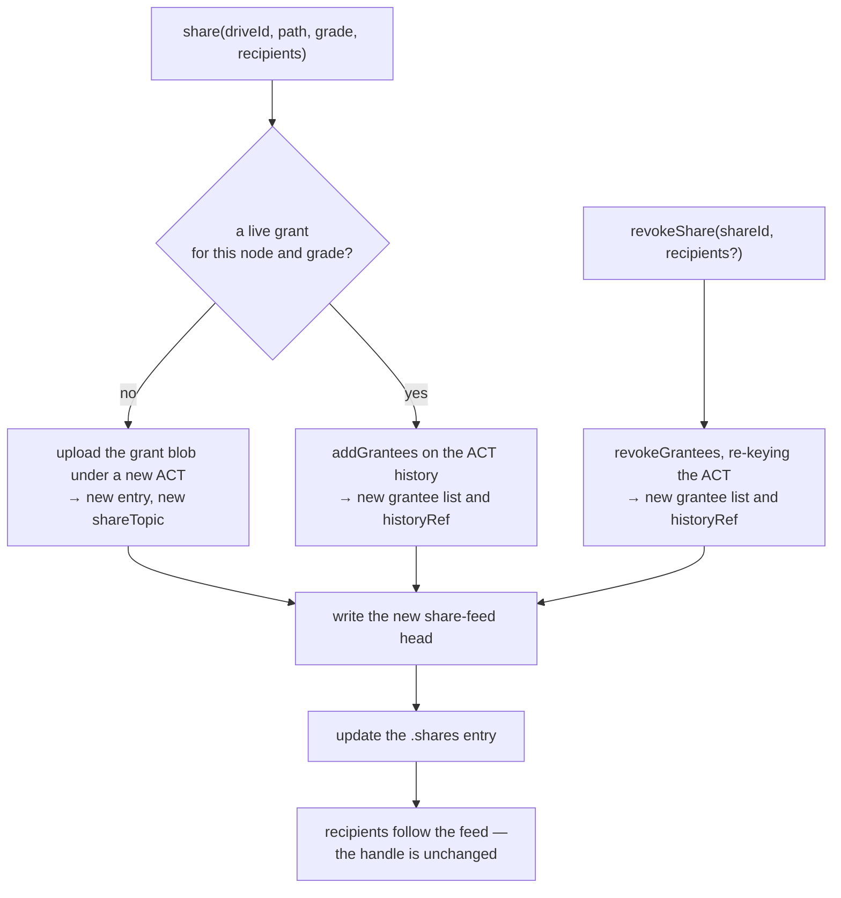

# Access control and sharing

How **@solarpunkltd/file-manager-lib** grants another identity access to part of a tree. See
[ENCRYPTION.md](ENCRYPTION.md) for the key hierarchy this builds on — in particular §3 (the key chain) and §4 (what is
encrypted).

**Scope: authorization only.** How a recipient _learns_ a share exists — messenger, URL, inbox feed, GSOC — belongs to
the application. This document defines what is granted, which objects hold it, and how a grant is amended and withdrawn.

---

## 1. ACT and sharing

ACT (Swarm's Access Control Trie) gates a small blob to a named grantee list. It is used for exactly that: the blob
carries the keys to a subtree, so **one ACT write covers a subtree of any size**, and the cost of a share scales with
the number of shares rather than with the size of what is shared. The tree itself is protected by the key chain, not by
ACT.

**ACT is what makes the handle publishable.** The grant blob's address — `reference`, `historyRef`, `publisher` — is not
a capability: to anyone outside the grantee list it dereferences to nothing. A share handle can therefore travel over a
public, untrusted channel, and the library stays out of key exchange.

### Share grades

| Grade  | Hand over                      | The recipient can                                                  |
| ------ | ------------------------------ | ------------------------------------------------------------------ |
| `List` | `K_meta(folder)`               | full recursive listing — names, types, versions. No file contents. |
| `Read` | `K_meta` + `K_content(folder)` | full read of the subtree, tracking future changes                  |
| `Open` | `K_content(file)`              | open that one file, tracking future versions                       |

The grades fall out of one asymmetry in the format: **folder and drive feed payloads are meta-keyed; file feed payloads
are content-keyed** (ENCRYPTION.md §3). Walking a tree needs `K_meta`; opening a leaf needs `K_content`. `K_meta(file)`
grants nothing — a file has no manifest — so an `Open` share carries `K_content` alone.

Browsing a folder while opening only one file inside it is two shares, not a grade.

**Shallow listing is not a grade.** Neither UNIX nor Google Drive offers "list this folder but not its subfolders", and
it would mean breaking the `K_meta` chain at every subfolder boundary, turning one share into N.

**Publishing a single file's content needs no share.** `record.content.reference` is 64 bytes of `address ‖ key` — a
self-contained capability any gateway will dereference, granted to whoever holds the string, pinned to one version.
`share()` covers everything that is not that.

---

## 2. What a share is made of

Three objects, none of which touch the shared node:



### The grant blob

ACT-protected, a few hundred bytes, independent of what it grants:

```jsonc
{
  "v": 1,
  "owner": "…", // the SHARER's identity.owner — every feed below is read under this address
  "topic": "…", // the shared node's feed topic
  "type": "folder", // NodeType — decides whether the feed payload is meta- or content-keyed
  "name": "Q3 report", // display label: a node's name lives in its PARENT's fork, which is not shared
  "meta": "…", // K_meta, hex — present for List and Read
  "content": "…", // K_content, hex — present for Read and Open
  "message": "…", // optional note from the sharer
}
```

`name` and `type` are not decoration. A recipient receives a topic, not a path: the fork prefix that names the node and
the metadata that types it both live in the parent manifest, which the share does not include.

`message` rides inside the blob rather than alongside the handle because the blob is the only ACT-gated part. A note
carried by a notification channel is in the clear; a note in the blob is readable only by the grantee list.

### The share feed — the stable handle

The ACT address changes whenever the grantee list is amended: `grantee.patch` returns a fresh `{reference, historyRef}`,
and `actUploadData` mints a new history per call. So the handle is not the ACT address — it is a feed:

```jsonc
// head of the share feed
{ "v": 1, "reference": "…", "historyRef": "…", "publisher": "…", "grade": "read" }
```

Random topic, owned by `identity.owner`, signed by `identity.signer` like every other feed the library writes. The
handle handed out is `{ shareTopic, owner }` and never changes; the churn lives in the payload, and recipients follow
it.

The payload is written **in the clear**: those three values are an address, not a capability (§1), and the recipient
holds none of our keys. An observer who learns the topic sees that a share exists and how often it is amended, never
what it grants.

### The `.shares` index

Owner-private, one entry per grant. It is what `shareList` exposes and what derives a node's share state (§8). It is
loaded as a unit — `shareList` is `undefined` until that has happened, which is not the same answer as `[]`:

```ts
interface ShareEntry {
  id: string;
  shareTopic: string; // the stable handle
  nodeTopic: string; // keyed by topic, so a move cannot stale it
  driveId: string;
  type: NodeType;
  path: string; // snapshot, display only
  grade: ShareGrade;
  granteeList: ActReferences; // the encrypted grantee list on Swarm — the membership
  act: ActReferences; // the grant blob; mirrors the current share-feed head
  publisher: Hex; // whoever encrypted
  createdAt: number;
  revokedAt?: number;
}
```

**One entry is one grant: one node, one grade, one grantee list, one blob, one ACT history, one share feed, one
handle.** The chain is 1:1 at every link, because a blob's bytes are fixed by `(node, grade)` and an ACT reference
resolves against exactly one grantee list. That is also the invariant `share()` maintains: **at most one live entry per
`(node, grade)`**. A second call for the same pair joins the standing grant rather than minting a rival to it, so a
node's audience has one address and not a set of them that could drift apart.

The grantee list is the plural part: one entry, many grantees. The entry holds its **address**, not a copy of its
members — `getShareGrantees()` fetches them on demand. Membership then has one home, so an amendment cannot leave the
index disagreeing with the ACT, and an entry stays a fixed size no matter how wide the audience. Dropping one person is
`revokeShare(id, [key])` against that list, never a second entry.

Two **grades** on one node are two entries, each with its own handle and each revocable alone — which is how a folder is
browsable by one audience and readable by another. A grade never changes on a standing grant: the blob is immutable and
already carries the keys it was minted with, so a downgrade would be a claim the bytes on Swarm do not honour.

### What a share does not touch

Not the shared node's feed, not its version, not its manifest, and not its drive's manifest. Sharing is additive: three
new objects and one index append. A node cannot tell it is shared.

### Cost

One ACT upload, one feed write for the share head, one write to `.shares` — whether the share is a single file or a
drive with ten thousand nodes. Paid from the **shared drive's** batch: if that stamp lapses the content goes with it, so
the grant's lifetime belongs to the same batch.

---

## 3. Publisher and grantee keys

Two compressed secp256k1 keys are in play, and both travel with the share: the **publisher** key of whoever encrypted
the blob, carried in the share-feed head, and the **grantee** key of each recipient, held in the ACT grantee list.

A grantee key is whichever key the recipient's ACT engine can decrypt with:

| Backend       | Where ACT runs         | The key that engine holds       |
| ------------- | ---------------------- | ------------------------------- |
| `BeeClient`   | on the Bee node        | the node's key — `actPublisher` |
| `SnahaClient` | in the swarm-id iframe | the origin-scoped `appKey`      |

Both engines implement the same ACT construction, and the publisher key is transmitted rather than assumed, so a share
crosses backends: a `BeeClient` publisher grants to a snaha `appKey`, a `SnahaClient` publisher grants to a recipient's
Bee node key. What an identity publishes as its grantee key is backend-specific; what the share carries is not.

The key that reads the sharer's feeds (`identity.owner`, FMK-derived) and the key that decrypts the grant
(backend-derived) come from different hierarchies. The first is inside the blob, the second is `publisher` in the feed
head.

---

## 4. Where share state lives

`.shares` and `.contacts` are **control plane** — state about the tree rather than content in it. They live as their own
nodes in the admin drive, beside the drive registry:



**A control-plane node is not a `FileRecord`.** It has its own topic, feed and key pair, and is registered as a fork in
the admin manifest once, at provisioning. Updates then write only its own feed — no version stamped into the fork, no
re-save of the admin manifest, and no churn on the one feed whose loss is identity-level rather than folder-level.

They are not drives. A drive appears in `driveList`, which means a drive picker, a rename, a trash, a forget, and an
accidental share. The admin drive holds what the user never sees.

### Drive, folder, mount

A drive differs from a folder in two ways that matter: it carries **its own batch**, and it can carry **a different
owner**. Everything else is bookkeeping.

> **A drive is a mount point. A folder is a path.**

```ts
enum DriveKind {
  Admin, // the registry and the control-plane nodes
  User, // My files, Websites — own batch, own content
  Shared, // "Shared with me": ours, written by us, but every node in it is someone else's
}
```

**Inbound shares are one drive, not one drive each.** `Shared` is a single container, provisioned with the admin state
and addressed through `sharedWithMe` rather than `driveList` — a drive the user can rename, trash or share back would be
a lie, since nothing in it is theirs. Inside, each accepted grant is one fork, and forks in a mantaray carry their own
`swarm-node-owner`, so a file and a folder from two different sharers sit side by side under one roof. That is also what
makes an `Open` grant of a single file mountable with no special case: it is a fork like any other.

The precedent is Google Drive's own "Shared with me" — one flat surface for everything others have given you, distinct
from the drives you own.

---

## 5. Accepting a share

An accepted share is a **mount**: a subtree whose owner is someone else and which cannot be written. The key chain
absorbs it with no new machinery — the received keys are re-wrapped under the recipient's own root key, exactly like any
child node.



Three properties make this cheap:

- **Re-wrapping under the recipient's own root** means the mount survives a session restart through the ordinary walk.
  No second key store, no persisted raw keys.
- **Writing the sharer's address into the fork** (`swarm-node-owner`) means the walk reads the mounted subtree under the
  right feed owner without the drive having to be foreign-owned.
- **Storing `shareTopic` on the fork** means the recipient re-reads the share feed to pick up an amended or rotated
  grant, without a new handle.

The grant blob names the node but not where it sits: a recipient gets a topic, and the fork prefix that would name it
lives in the sharer's parent manifest, which the share does not include. So the mount is named from the blob's `name`,
suffixed when that name is already taken — two people may share a `Q3 report` and both land intact. The node's topic is
what identifies it, so accepting the same grant twice is refused rather than mounted twice.

A grade the recipient cannot walk is refused at accept time rather than mounted broken: `assertShareGrade` re-runs on
the untrusted blob, because a blob written by someone else is data, not a promise. Which keys the blob must carry
follows from the grade: `List` needs `K_meta`, `Open` needs `K_content`, `Read` needs both.

**A `List` mount carries half a key chain, and the chain stays half the whole way down.** `unwrapChild` derives a
content key only where both the parent's and the fork's are present, so every node under a `List` mount is meta-only —
listable, never openable. A file listed that way is a `FileRecord` built from its fork metadata alone: name, path,
topic, owner and version, with `content` absent. That is the whole of what a manifest holds about a file; size, MIME
type and timestamp live in the content-keyed record. Reaching for the bytes fails where the key is missing rather than
at accept time: `downloadFiles` reports the file under `failed`, and anything needing `K_content` throws a
`KeyringError`. It is the reach of a UNIX directory that is readable but not searchable — `ls` works, `stat` does not.

---

## 6. Groups, amendment and withdrawal

A **group** is a named, reusable audience stored in `.contacts`: an id, a label, and its members' grantee keys. It is a
convenience in front of `share()`, which is resolved to keys at call time — so a group can change without the library
having to trust `.contacts` to know who holds a grant.

Membership moves in one direction per call. `share()` adds and `revokeShare` removes, and there is at most one live
grant per node and grade — so `share()` on a node already shared at that grade patches the standing grant rather than
issuing a second one, while a different grade mints its own, independently revocable.



Amending never re-uploads the grant blob: both backends patch a grantee list against the ACT history it already has, so
the protected bytes and — on `BeeClient` — the encrypted reference stay put. That is also why a grade is fixed for the
life of a grant: the blob is immutable and already carries the keys it was minted with.

`revokeShare(shareId, recipients?)` covers both shapes of withdrawal against that one list. Named recipients are
intersected with the current membership and dropped; omitting them drops everyone. Either way the ACT is re-keyed and
the new head published, so those still on the list follow the feed and keep reading while those removed are left on an
address that no longer resolves for them. **An emptied list closes the entry** — `revokedAt` is stamped whether the last
member left by name or by omission, because a grant reaching nobody is one `share()` would otherwise keep amending.

A revoked entry stays in `.shares` as the record that the grant existed, and is never matched again: re-sharing the same
node at the same grade mints a fresh grant with a fresh handle, which is the honest outcome — the old handle was
published to people who no longer hold it.

**Revocation denies future reads.** Every key a recipient already unwrapped and every chunk they already dereferenced
stays readable: Swarm has no delete, and a 64-byte reference is a capability for as long as the chunks live.

**Rotation is what withdraws past access.** Re-keying a subtree re-seals one feed payload per node and re-wraps each
node's child keys; content is never re-uploaded, since the content references are unchanged. It runs as a resumable job
with a persisted progress marker — a half-rotated subtree leaves parents holding wrapped keys that no longer match their
children, and Bee no-ops on a taken feed index.

**Lifecycle of the shared node.** `trash` leaves grants intact: the node still exists, the move is reversible, and its
keys and feed are untouched. `forget` — and `emptyTrash`, which is `forget` in bulk — revokes every grant on the node
and stamps its entries `revokedAt`, because the fork it pointed at is gone from the manifest.

---

## 7. Port surface

Sharing adds grantee management to `SwarmClient`:

| Port                                                          | `BeeClient`                                    | `SnahaClient`                            |
| ------------------------------------------------------------- | ---------------------------------------------- | ---------------------------------------- |
| `uploadProtected(batchId, data, grantees?, historyRef?, …)`   | `grantee.create` → history, then `data.upload` | `actUploadData(data, grantees)`          |
| `addGrantees(batchId, listRef, historyRef, add)`              | `grantee.patch(batchId, listRef, history, …)`  | `actAddGrantees(history, add)`           |
| `revokeGrantees(batchId, listRef, historyRef, contentRef, …)` | `grantee.patch(batchId, listRef, history, …)`  | `actRevokeGrantees(history, content, …)` |
| `listGrantees(listRef, historyRef)`                           | `grantee.get(listRef)`                         | `actGetGrantees(history)`                |

The two backends address a grantee list differently — Bee by the list's own reference, swarm-id by the ACT history — so
the port carries both and each adapter ignores the one it does not need. `revokeGrantees` returns a rotated `contentRef`
when the backend produces one.

---

## 8. Derived share state

A node's share state is **derived, never persisted** — the rule `status` already follows. The truth is `.shares`; a
record carries no share field on the wire.

```ts
enum ShareState {
  None,
  Direct, // this node is the subject of a share entry
  Inherited, // an ancestor is
}
```

`Inherited` carries real information: a `K_meta(folder)` grant reaches every descendant, so a per-node flag computed
without ancestor context would be wrong on every child. Because `.shares` is keyed by topic and a walk already holds
every ancestor's topic, the derivation is N map lookups with no extra I/O, and a `move` cannot stale it.
