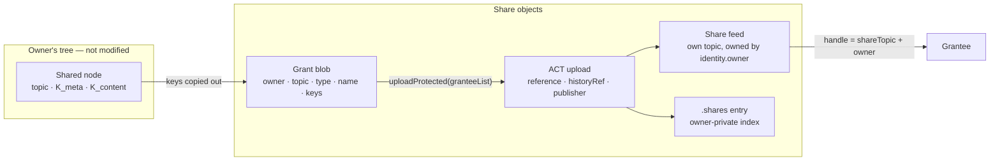
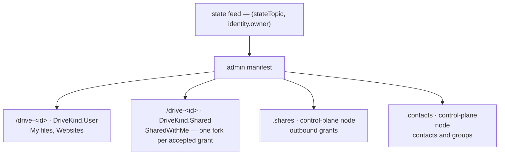
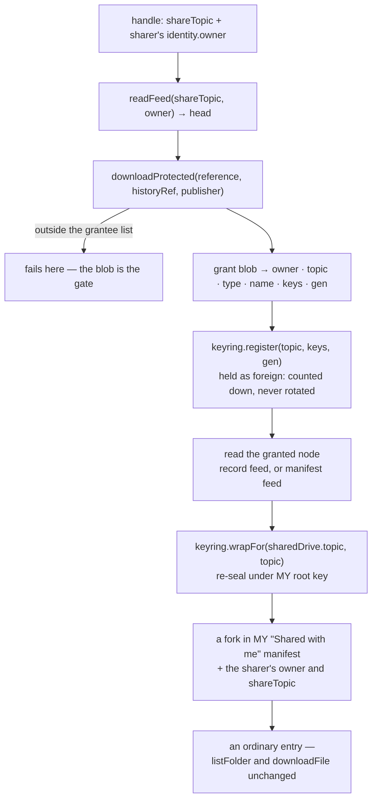
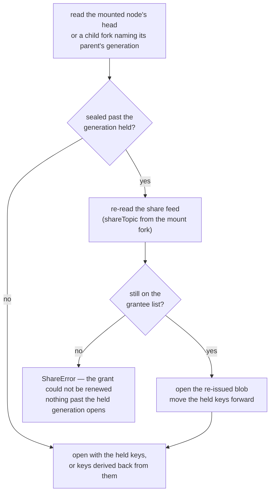
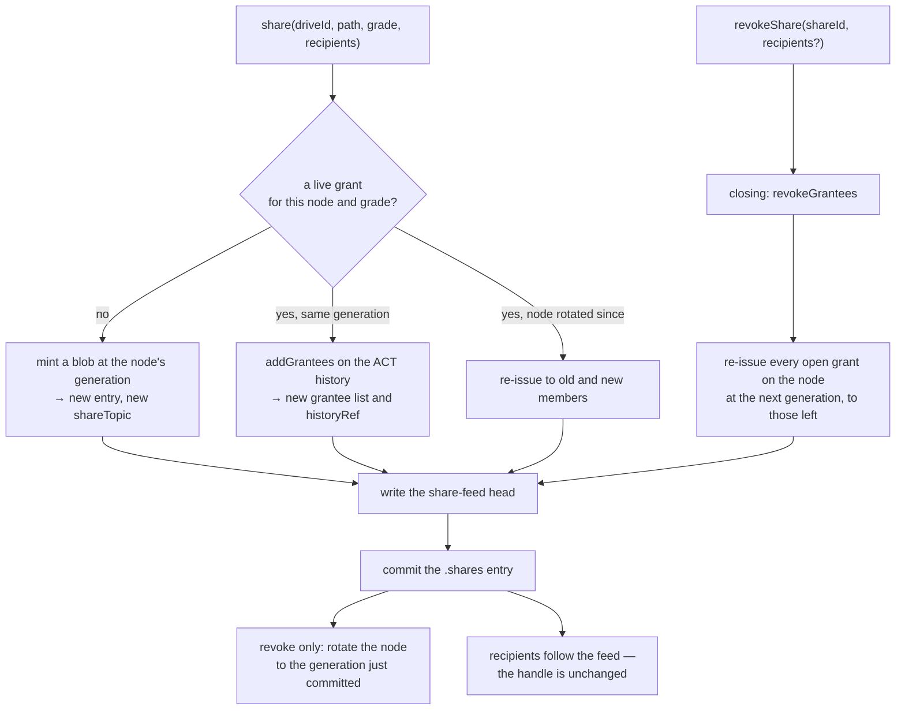
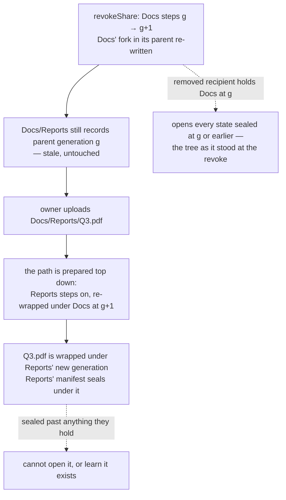

# Access control and sharing

How **@solarpunkltd/file-manager-lib** grants another identity access to part of a tree. See
[ENCRYPTION.md](ENCRYPTION.md) for the key hierarchy this builds on — in particular §3 (the key chain) and §4 (what is
encrypted).

**Scope: authorization only.** How a recipient _learns_ a share exists — messenger, URL, inbox feed, GSOC — belongs to
the application. This document defines what is granted, which objects hold it, and how a grant is amended and withdrawn.

---

## 1. ACT and sharing

ACT (Swarm's Access Control Trie) gates a small blob to a named grantee list. It is used for exactly that: the blob
carries the keys to a subtree, so **one ACT write covers a subtree of any size**, and the cost of a share scales with
the number of shares rather than with the size of what is shared. The tree itself is protected by the key chain, not by
ACT.

**ACT is what makes the handle publishable.** The grant blob's address — `reference`, `historyRef`, `publisher` — is not
a capability: to anyone outside the grantee list it dereferences to nothing. A share handle can therefore travel over a
public, untrusted channel, and the library stays out of key exchange.

### Share grades

| Grade  | Hand over                      | The recipient can                                                  |
| ------ | ------------------------------ | ------------------------------------------------------------------ |
| `List` | `K_meta(folder)`               | full recursive listing — names, types, versions. No file contents. |
| `Read` | `K_meta` + `K_content(folder)` | full read of the subtree, tracking future changes                  |
| `Open` | `K_content(file)`              | open that one file, tracking future versions                       |

The grades fall out of one asymmetry in the format: **folder and drive feed payloads are meta-keyed; file feed payloads
are content-keyed** (ENCRYPTION.md §3). Walking a tree needs `K_meta`; opening a leaf needs `K_content`. `K_meta(file)`
grants nothing — a file has no manifest — so an `Open` share carries `K_content` alone.

Browsing a folder while opening only one file inside it is two shares, not a grade.

**Shallow listing is not a grade.** Neither UNIX nor Google Drive offers "list this folder but not its subfolders", and
it would mean breaking the `K_meta` chain at every subfolder boundary, turning one share into N.

**A drive root is not a share subject.** `.trash` sits at the root of a drive, and every fork under that root is sealed
under the root's `K_meta` — so a grant on the root hands over the trash along with the live tree, which is what
`share()` refuses when a path names `.trash` directly. Omitting the folder from the walk would not withhold its keys.
The shareable units are the folders inside a drive: the root of a personal volume is not shareable in Google Drive or
Dropbox either, and a volume that is shared by construction is a different object, with membership and a trash of its
own.

**Publishing a single file's content needs no share.** `record.content.reference` is 64 bytes of `address ‖ key` — a
self-contained capability any gateway will dereference, granted to whoever holds the string, pinned to one version.
`share()` covers everything that is not that.

---

## 2. What a share is made of

Three objects, none of which touch the shared node:



### The grant blob

ACT-protected, a few hundred bytes, independent of what it grants:

```jsonc
{
  "v": 1,
  "owner": "…", // the SHARER's identity.owner — every feed below is read under this address
  "topic": "…", // the shared node's feed topic
  "type": "folder", // NodeType — decides whether the feed payload is meta- or content-keyed
  "name": "Q3 report", // display label: a node's name lives in its PARENT's fork, which is not shared
  "grade": "read", // ShareGrade — gated with the keys, so the grade is not public
  "meta": "…", // K_meta, hex — present for List and Read
  "content": "…", // K_content, hex — present for Read and Open
  "gen": 3, // the key generation of meta/content — every earlier one derives from them
  "message": "…", // optional note from the sharer
}
```

`name` and `type` are not decoration. A recipient receives a topic, not a path: the fork prefix that names the node and
the metadata that types it both live in the parent manifest, which the share does not include.

`gen` is what the keys are worth. A node's keys sit on a reverse hash chain (ENCRYPTION.md §3), so the blob opens every
state of the node sealed at `gen` or earlier and none sealed later. A blob is therefore a snapshot of one generation: when
the node rotates, the grant is re-issued as a new blob at the new generation (§6).

`message` rides inside the blob rather than alongside the handle because the blob is the only ACT-gated part. A note
carried by a notification channel is in the clear; a note in the blob is readable only by the grantee list.

### The share feed — the stable handle

The ACT address changes whenever the grantee list is amended — `grantee.patch` returns a fresh `{reference,
historyRef}`, and `actUploadData` mints a new history per call — and whenever the node's keys rotate, since the grant is
then re-issued as a new blob. So the handle is not the ACT address — it is a feed:

```jsonc
// head of the share feed
{ "v": 1, "reference": "…", "historyRef": "…", "publisher": "…" }
```

Random topic, owned by `identity.owner`, signed by `identity.signer` like every other feed the library writes. The
handle handed out is `{ shareTopic, owner }` and never changes; the churn lives in the payload, and recipients follow
it.

The payload is written **in the clear**: those three values are an address, not a capability (§1), and the recipient
holds none of our keys. An observer who learns the topic sees that a share exists and how often it is amended, never
what it grants.

### The `.shares` index

Owner-private, one entry per grant. It is what `shareList` exposes, and the record a revoke or a re-issue works from.

`initialize` resolves the node and stops there. The document behind it is a network read that a session which never
shares anything has no use for, so it is loaded on first use — `listShares`, or any grant operation — and cached for the
session, the same way a folder is. Until then `shareList` is `undefined`, which is not the same answer as `[]`.

A row that does not parse costs its own grant and no other. The load keeps every entry it understands and reports the
rest once through `MALFORMED_SHARES`, carrying the raw row so an application can log or salvage it. They are then left
behind, and the next save writes the index without them — the index is a feed, so the slot holding a dropped row stays
readable, and a grant whose references do not parse is no more revocable for being carried forward. A document that is
not an array is still fatal: that is the wrong document, not one damaged row.

```ts
interface ShareEntry {
  id: string;
  shareTopic: string; // the stable handle
  nodeTopic: string; // keyed by topic, so a move cannot stale it
  driveId: string;
  type: NodeType;
  path: string; // snapshot, display only
  grade: ShareGrade;
  granteeList: ActReferences; // the encrypted grantee list on Swarm — the membership
  act: ActReferences; // the grant blob; mirrors the current share-feed head
  publisher: Hex; // whoever encrypted
  gen: number; // the node's key generation the current blob carries
  grantees: Hex[]; // membership as of the last write — what a re-issue is addressed to
  message?: string; // carried into every re-issue of the blob
  createdAt: number;
  revokedAt?: number;
}
```

**One entry is one grant: one node, one grade, one handle, one share feed — and at any moment one blob, one grantee
list and one ACT history.** The chain is 1:1 at every link, because a blob's bytes are fixed by `(node, grade, gen)` and
an ACT reference resolves against exactly one grantee list. The blob and the list behind the handle are replaced when
the node rotates; the handle is not. That is also the invariant `share()` maintains: **at most one live entry per
`(node, grade)`**. A second call for the same pair joins the standing grant rather than minting a rival to it, so a
node's audience has one address and not a set of them that could drift apart.

The grantee list is the plural part: one entry, many grantees. **The ACT list on Swarm is the membership** —
`getShareGrantees()` fetches it, and `revokeShare` reads it before removing anyone, so what a revoke acts on is always
what the ACT enforces. `grantees` is a copy kept for one job: re-issuing the grant after a rotation, which happens after
ordinary writes and should not cost an ACT read per grant. Dropping one person is `revokeShare(id, [key])` against that
list, never a second entry.

Two **grades** on one node are two entries, each with its own handle and each revocable alone — which is how a folder is
browsable by one audience and readable by another. A grade never changes on a standing grant: the keys a blob carries
are what its grade means, so moving an audience to another grade is a revoke at one grade and a share at the other.

### What a share does not touch

Not the shared node's feed, not its version, not its manifest, and not its drive's manifest. Sharing is additive: three
new objects and one index append. A node cannot tell it is shared.

Withdrawing is not free of the tree in the same way: a revoke rotates the node, which rewrites its fork in the parent
manifest (§6).

### Cost

One ACT upload, one feed write for the share head, one write to `.shares` — whether the share is a single file or a
folder with ten thousand nodes. Paid from the **shared drive's** batch: if that stamp lapses the content goes with it, so
the grant's lifetime belongs to the same batch.

---

## 3. Publisher and grantee keys

Two compressed secp256k1 keys are in play, and both travel with the share: the **publisher** key of whoever encrypted
the blob, carried in the share-feed head, and the **grantee** key of each recipient, held in the ACT grantee list.

A grantee key is whichever key the recipient's ACT engine can decrypt with. The port names it `SwarmClient.granteeKey`,
and it is what a recipient hands out to be shared with:

| Backend       | Where ACT runs         | `granteeKey`                                               |
| ------------- | ---------------------- | ---------------------------------------------------------- |
| `BeeClient`   | on the Bee node        | the node's key — the same as `actPublisher`                |
| `SnahaClient` | in the swarm-id iframe | the account-wide sharing key, `identity.sharingPublicKey`  |

The swarm-id sharing key belongs to the user's account, not to the site, so a grant made out to it opens on every origin
the recipient logs in from: the iframe decrypts with whichever of its keys a grant names. Only grants cross origins this
way — drives stay with the origin that holds them (ENCRYPTION.md, [Portability versus
phishability](ENCRYPTION.md#portability-versus-phishability)). Being the same on every site, the key also lets the sites
a user shares through recognise them, as an account email does in Google Drive.

Both engines implement the same ACT construction, and the publisher key is transmitted rather than assumed, so a share
crosses backends: a `BeeClient` publisher grants to a recipient's sharing key, a `SnahaClient` publisher grants to a
recipient's Bee node key. What an identity publishes as its grantee key is backend-specific; what the share carries is
not.

The key that reads the sharer's feeds (`identity.owner`, FMK-derived) and the key that decrypts the grant
(backend-derived) come from different hierarchies. The first is inside the blob, the second is `publisher` in the feed
head.

---

## 4. Where share state lives

`.shares` and `.contacts` are **control plane** — state about the tree rather than content in it. They live as their own
nodes in the admin drive, beside the drive registry:



**A control-plane node is not a `FileRecord`.** It has its own topic, feed and key pair, and is registered as a fork in
the admin manifest once, at provisioning. Updates then write only its own feed — no version stamped into the fork, no
re-save of the admin manifest, and no churn on the one feed whose loss is identity-level rather than folder-level.

They are not drives. A drive appears in `driveList`, which means a drive picker, a rename, a trash, a forget, and an
accidental share. The admin drive holds what the user never sees.

### Drive, folder, mount

A drive differs from a folder in two ways that matter: it carries **its own batch**, and it can carry **a different
owner**. Everything else is bookkeeping.

> **A drive is a mount point. A folder is a path.**

```ts
enum DriveKind {
  Admin, // the registry and the control-plane nodes
  User, // My files, Websites — own batch, own content
  Shared, // "Shared with me": ours, written by us, but every node in it is someone else's
}
```

**Inbound shares are one drive, not one drive each.** `Shared` is a single container, provisioned with the admin state
and addressed through `sharedWithMe` rather than `driveList` — a drive the user can rename, trash or share back would be
a lie, since nothing in it is theirs. Inside, each accepted grant is one fork, and forks in a mantaray carry their own
`swarm-node-owner`, so a file and a folder from two different sharers sit side by side under one roof. That is also what
makes an `Open` grant of a single file mountable with no special case: it is a fork like any other.

The precedent is Google Drive's own "Shared with me" — one flat surface for everything others have given you, distinct
from the drives you own.

---

## 5. Accepting a share

An accepted share is a **mount**: a subtree whose owner is someone else and which cannot be written. The key chain
absorbs it with no new machinery — the received keys are re-wrapped under the recipient's own root key, exactly like any
child node.



**The granted node is read before the fork is written.** A mount is durable and a node is identified by topic, so a fork
written ahead of that read would answer every later attempt with "already mounted" — an accept that cannot complete has
to leave nothing behind. Accepting is therefore safe to retry: everything before the manifest write is a read.

Three properties make this cheap:

- **Re-wrapping under the recipient's own root** means the mount survives a session restart through the ordinary walk.
  No second key store, no persisted raw keys.
- **Writing the sharer's address into the fork** (`swarm-node-owner`) means the walk reads the mounted subtree under the
  right feed owner without the drive having to be foreign-owned.
- **Storing `shareTopic` on the fork** means the recipient re-reads the share feed to pick up a re-issued grant, without
  a new handle.

The grant blob names the node but not where it sits: a recipient gets a topic, and the fork prefix that would name it
lives in the sharer's parent manifest, which the share does not include. So the mount is named from the blob's `name`,
suffixed when that name is already taken — two people may share a `Q3 report` and both land intact. The node's topic is
what identifies it, so a node mounts once: accepting a second grant on it — the same one again, or one at another
grade — is refused rather than mounted twice.

A grade the recipient cannot walk is refused at accept time rather than mounted broken: `assertShareGrade` re-runs on
the untrusted blob, because a blob written by someone else is data, not a promise. It is the same rule the sharer ran,
so a blob claiming a drive root or a control-plane node is refused here too. Which keys the blob must carry follows from
the grade: `List` needs `K_meta`, `Open` needs `K_content`, `Read` needs both.

**A `List` mount carries half a key chain, and the chain stays half the whole way down.** `unwrapChild` derives a
content key only where both the parent's and the fork's are present, so every node under a `List` mount is meta-only —
listable, never openable. A file listed that way is a `FileRecord` built from its fork metadata alone: name, path,
topic, owner and version, with `content` absent. That is the whole of what a manifest holds about a file; size, MIME
type and timestamp live in the content-keyed record. Reaching for the bytes fails where the key is missing rather than
at accept time: `downloadFiles` reports the file under `failed`, and anything needing `K_content` throws a
`KeyringError`. It is the reach of a UNIX directory that is readable but not searchable — `ls` works, `stat` does not.

### Following a rotation

A mount is held at the generation its grant carried, and everything below it is held as the sharer's chain — the
recipient can count down it but never step it on. When the sharer rotates the mounted node and re-issues the grant, the
recipient notices on its own:



Renewal lives in memory. The mount fork keeps the keys it was accepted with, so each session that meets a rotation
renews once — one share-feed read and one ACT download per mount — and concurrent reads of the same mount share that one
renewal. A node below the mount that rotated on its own needs no grant: its parent's manifest carries the new wrap,
and the recipient picks it up the next time it reads that manifest.

### Unmounting

`unmountShare(path)` removes a mount from the recipient's `Shared` drive — Google Drive's "Remove" on an item in
"Shared with me". The fork goes and its keys are dropped; the grant itself is the sharer's and is not touched, so the
same handle can be accepted again. A mount whose grant was withdrawn stays until it is unmounted, failing to open
anything written after the withdrawal.

---

## 6. Groups, amendment and withdrawal

A **group** is a named, reusable audience stored in `.contacts`: an id, a label, and its members' grantee keys. It is a
convenience in front of `share()`, which is resolved to keys at call time — so a group can change without the library
having to trust `.contacts` to know who holds a grant.

Membership moves in one direction per call. `share()` adds and `revokeShare` removes, and there is at most one live
grant per node and grade — so `share()` on a node already shared at that grade joins the standing grant rather than
issuing a second one, while a different grade mints its own, independently revocable.



Amending at the node's current generation never re-uploads the grant blob: both backends patch a grantee list against
the ACT history it already has, so the protected bytes and — on `BeeClient` — the encrypted reference stay put. Once the
node has rotated, a patch would hand the newcomers keys the node has moved past, so the grant is re-issued instead, to
old and new members together.

`revokeShare(shareId, recipients?)` covers both shapes of withdrawal. Named recipients are intersected with the current
membership — read from the ACT, not the index — and dropped; omitting them drops everyone. **An emptied list closes the
entry** — `revokedAt` is stamped whether the last member left by name or by omission, because a grant reaching nobody is
one `share()` would otherwise keep amending.

A revoked entry stays in `.shares` as the record that the grant existed, and is never matched again: re-sharing the same
node at the same grade mints a fresh grant with a fresh handle, which is the honest outcome — the old handle was
published to people who no longer hold it.

### Withdrawal rotates the node

Every node's keys sit on a reverse hash chain of their own (ENCRYPTION.md §3). A holder of generation `g` derives every
earlier generation and none later, so **stepping a node to `g + 1` withdraws its future writes from everyone who held
`g`**. A revoke does exactly that to the shared node, and hands the new generation to whoever is still meant to have it.
It records who holds that generation before the node moves to it:

1. **Withdraw the ACT.** A grant that closes has its grantee list revoked and its head republished. A grant that stays
   open skips this step: it is re-issued on a fresh list, which leaves the removed recipients out anyway.
2. **Re-issue** every open grant on the node — this one if it stays open, and those at any other grade — as a new blob
   at the next generation, each behind its unchanged handle. The owner derives that generation from the FMK without
   stepping the node, and a holder of it derives the current one, so those who stay keep reading throughout.
3. **Commit** the index. Every entry on the node now names the next generation — a closed one too — and who holds it.
4. **Rotate** the shared node to that generation and re-wrap it under its parent, which rewrites its fork in the parent
   manifest. The node's own head is left as it is.

A failure before the commit leaves the index as it was, and the call is safe to retry: nothing new has reached the
removed recipients, and the retry issues the same generation again. Once the commit lands, the withdrawal holds whether
or not the rotation does. The generation an entry names is a **floor** for its node: the index is loaded before a
session's first write, and a node below its floor rotates up to it before anything is written to it. A rotation that
fails is logged, and the revoke still returns.

The cost is constant in the size of the tree: one manifest save for the parent, one ACT upload and one head per open
grant on the node, one index write. Nothing below the node is visited.

### One instance, one call at a time

Sharing assumes one `FileManagerBase` per identity at a time, making one call at a time. The index is written whole, and
a floor binds only a session that has loaded it, so two instances writing at once could each commit an index built from
the same predecessor, or seal a write at a generation the other has just withdrawn.

A grant change runs to completion once started. `share` and `revokeShare` take headers and a timeout but no abort signal,
and the re-issue that follows a write finishes even when that write was aborted — like `chmod`, and unlike a transfer, a
permission change is not something to stop halfway.

### Lazy re-keying

A rotation does not reach down. The nodes below keep the keys they had, and each fork still records the parent
generation it was wrapped under — which is now behind. **A node whose recorded parent generation lags its parent's is
stale**, and it rotates before anything is written to it:



Every write goes through that preparation — upload, update, create folder, move, trash, recover, restore — and the
store's save path refuses a write to a node that is still stale, so no write can seal under a generation that a rotation
above it has already withdrawn. A node rotated on the way may itself be shared; its open grants are re-issued once the
write lands, the same way a revoke re-issues them.

Two more states count as stale, and both are left by a write that did not finish. A node **below its floor** is one a
committed revoke has not rotated yet. A node whose **fork lags it** is one whose rotation stepped the chain but whose
manifest save failed. That save may have landed anyway, so the step is never rolled back — a node sealed at the old
generation would be open again to whoever the rotation withdrew. Either way the next write through the node rotates it
first.

The owner never loses track of a generation: the chains are rooted in the FMK, so any generation derives from the
topic alone, and each feed head names the one it was sealed under. A node written at a generation this session has not
seen — another device rotated it — opens all the same, and the session's own next write seals at least that high.

### What withdrawal denies

**What withdrawal denies is future writes.** It does not deny access a recipient held but never exercised: everything
that existed at the moment of withdrawal stays readable to them, whether or not they had fetched it. Eagerly re-sealing
those nodes would not change that — Swarm has no delete, a 64-byte reference is a capability for as long as the chunks
live, and a `read` recipient can mirror a subtree in one pass the moment they accept. Paying a write per node to re-seal
state the recipient is free to have copied buys nothing.

Content is never re-uploaded. The content references are unchanged; only the pointers to them are re-sealed, as each
node is next written.

**Withdrawal is exactly as wide as the grant.** The generation belongs to the node, so a recipient removed from one
grant keeps precisely what their other grants give them, and nothing more:

- A second grant in the same drive — held already, or issued later — keeps giving its own node and everything below it.
  Beside or below the revoked node that is none of its new keys. On a folder **above** it, it is all of them, since the
  new generation is wrapped under that folder: removing someone from `Docs` while they hold a grant on its parent
  withdraws nothing. Google Drive behaves the same way — access inherited from a parent folder cannot be removed on the
  child.
- A second grade on the same node is re-issued at the new generation with the keys that grade carries: revoking `read`
  while `list` stays keeps listings current and closes every content written afterwards.
- A node moved out of a shared folder rotates on the way, so the folder's grantees keep what they had of it and none of
  what follows.

### What rotates

| Event                                        | Rotates                               | Why                                                                            |
| -------------------------------------------- | ------------------------------------- | ------------------------------------------------------------------------------ |
| `revokeShare`                                | the shared node                       | withdraws its future writes from the removed recipients                        |
| the first write below a rotated node         | each stale node on the path, top down | re-wraps it under its parent's new generation                                  |
| `move` to another folder, `trash`, `recover` | the moved node                        | whoever reached it through its old place stops following it, as after a delete |
| a rename within one folder                   | nothing                               | same parent, same readers                                                      |

Moving a node _into_ a shared folder hands the folder's grantees its new generation, and with it every earlier one: its
version history comes along, as it does when a file is moved into a shared folder on Google Drive.

A chain allows `KEY_CHAIN_LENGTH` (1024) rotations, and every event above spends one on the node it rotates. A node that
has spent them all refuses to rotate again with a `KeyringError`: it can no longer be revoked, moved to another folder,
or written once a rotation above it has made it stale.

### Re-issuing grants

A rotation leaves every open grant on the rotated node carrying keys one generation short, so the grant is re-issued: a
new blob at the current generation, uploaded under ACT to the entry's `grantees` and published as the next head of its
share feed. The handle does not change, and recipients pick the new blob up as in §5.

A re-issue mints a **fresh** grantee list rather than patching the old one, because a swarm-id backend cannot continue an
ACT history. It builds the blob from the index entry rather than from the old blob, which under `BeeClient` only the
publishing node can open.

A revoke re-issues the grants on the node it rotates within the call. Every other rotation happens inside an ordinary
write, and the grants it touches are re-issued once that write has landed. A re-issue that fails is logged and does not
fail the write — the data is already on Swarm. The grant stays a generation behind, its recipients reading everything up
to the rotation and nothing after, until the session's next write retries it, or — in a later session — the next
rotation, amendment or revoke that reaches it.

### Re-sharing

A node shared with you cannot be re-shared: `share()` refuses the `Shared` drive with a `ShareError`. A grant hands
over the sharer's keys on the sharer's chain, and only the sharer can step that chain on — so a re-share would be a grant
its issuer could never withdraw.

### Lifecycle of the shared node

`trash` and `recover` move the node to another folder, so they rotate it: readers who reached it through its old folder
stop following it, while its own open grants are re-issued and keep reading. `forget` and `emptyTrash` drop forks from a
manifest and rotate nothing — nothing is written to the node again, so there is nothing left to withdraw. None of the
four closes a grant, and none removes the node: its feed, keys and chunks survive all of them, and a recipient resolves
the subject by topic and owner rather than through the sharer's manifest.

Withdrawing is `revokeShare`, and the caller chooses when: it takes a share id rather than a path, so it works as well
after the node has moved, or its fork is gone, as before. An entry's `path` is a snapshot, so a revoke that no longer
finds the node there walks the drive — trash included — to locate it, and records where it was found. A node no longer
in the drive is not rotated, since nothing will be written to it again, and the revoke withdraws the ACT alone.
`shareList` is where a forgotten node's entries are found.

`forgetDrive` closes every open grant on the drive before it forgets it. Nothing is written to a forgotten drive again,
so nothing rotates: each grant's ACT is withdrawn, so a handle not yet accepted opens nothing, and its entry is stamped
`revokedAt`. Recipients who accepted keep what they could already read, as after any revoke.

---

## 7. Port surface

Sharing adds grantee management to `SwarmClient`:

| Port                                                          | `BeeClient`                                    | `SnahaClient`                            |
| ------------------------------------------------------------- | ---------------------------------------------- | ---------------------------------------- |
| `uploadProtected(batchId, data, grantees?, historyRef?, …)`   | `grantee.create` → history, then `data.upload` | `actUploadData(data, grantees)`          |
| `addGrantees(batchId, listRef, historyRef, add)`              | `grantee.patch(batchId, listRef, history, …)`  | `actAddGrantees(history, add)`           |
| `revokeGrantees(batchId, listRef, historyRef, contentRef, …)` | `grantee.patch(batchId, listRef, history, …)`  | `actRevokeGrantees(history, content, …)` |
| `listGrantees(listRef, historyRef)`                           | `grantee.get(listRef)`                         | `actGetGrantees(history)`                |

The two backends address a grantee list differently — Bee by the list's own reference, swarm-id by the ACT history — so
the port carries both and each adapter ignores the one it does not need. `revokeGrantees` returns a rotated `contentRef`
when the backend produces one.
