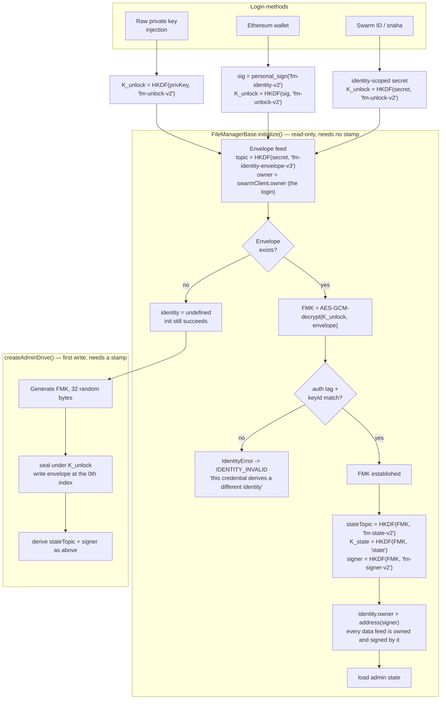
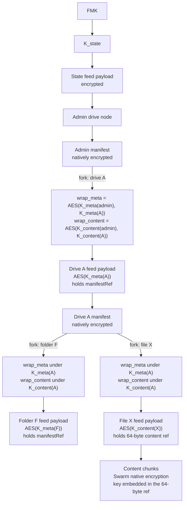
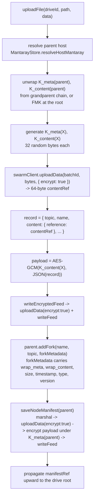
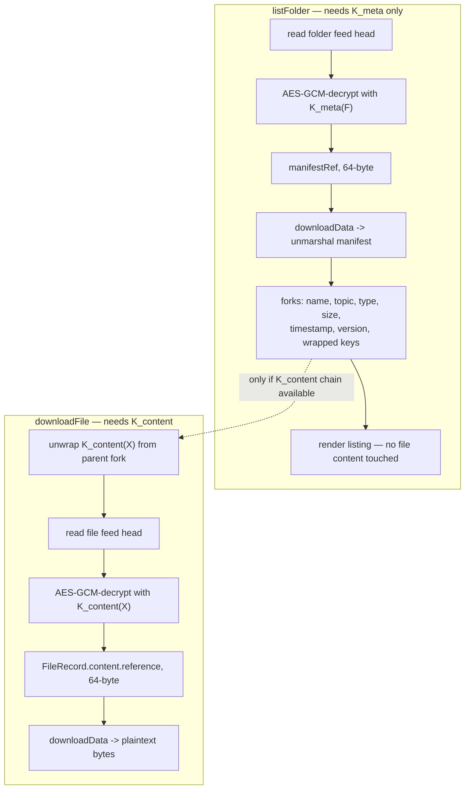
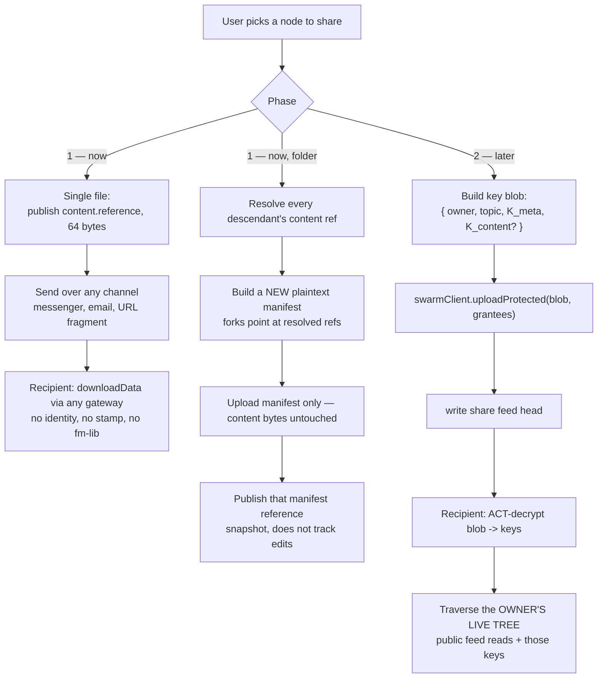

# Client-side encryption + ACT sharing — design

**Branch:** `feat/encryption` · **Status:** design, not implemented · **Targets:** v2 (breaking)

Replaces per-node ACT with client-side symmetric encryption over a two-chain key hierarchy, and narrows ACT to what it
is actually good at: gating a small key blob to a named grantee list at share time.

**Current v2 data is not readable under this design.** No migration path is planned or owed.

---

## 1. The model in one paragraph

Content bytes are uploaded with **Swarm native encryption**, so every object gets a random key that Bee embeds in its
64-byte reference — we never choose or store a content key. Those references live in the index (feed payloads and
manifests), and the index is encrypted **client-side** under keys we do control. Each node carries two keys: `K_meta`
unlocks its listing, `K_content` unlocks its content pointer. Each is wrapped under the parent's corresponding key, so
the tree carries two parallel key chains. Sharing hands over keys, not data. ACT is used only to deliver those keys to a
named grantee list — a payload of a few hundred bytes — so its cost scales with the number of shares, not with the size
of the tree.

Design rationale and the discussion that produced it are not repeated here; this document is the specification.

---

## 2. Flowcharts

### 2.1 Identity — login to FileManager key

Three login paths converge on one **FileManager Key (FMK)**. The FMK is the root of all index encryption and is what
makes a user's drives reachable from any origin and any login method.



Notes:

- **Two addressing layers, and the split is the whole portability mechanism.** The envelope lives under the _login's_
  address — it has to, because it must be findable before the FMK exists, and because only the login can sign a write
  there. Everything else — the state feed and every node feed — is owned and signed by `HKDF(FMK, 'fm-signer-v2')`.
  Without that second layer the FMK would make the state feed _topic_ portable while the owner stayed per-login, and a
  Swarm feed is addressed by the **pair**: two credentials sharing one FMK would derive an identical topic, look under
  two different owners, and find two disjoint feeds. Same identity, no shared data.
- **One owner, one source of truth.** `Credential` carries only `unlockSecret()`; it does not carry an owner, because
  the envelope's location is the client's address and nothing else can be. `IdentityInfo.owner` is the FMK-derived
  address — a property of the identity, not of the session — so it is stable across every credential that unseals the
  same FMK, and is the only owner a consumer ever sees. It is also the _only_ such stable identifier on the public
  surface: `keyId` is deliberately not one (below).
- **The signer is the one secret held as bytes.** secp256k1 is outside WebCrypto, so a client-side feed signer cannot be
  a non-extractable `CryptoKey` the way every FMK-derived AES key is. It sits on `Identity` and is deliberately absent
  from the public `IdentityInfo`. This is inherent to signing in the page, not a property of this particular scheme.
- **It crosses the port.** `writeFeed` takes `options.signer`, verified supported on both backends —
  `bee.feed.makeWriter(topic, signer)` and swarm-id's `SequentialFeedWriterOptions.signer`, which the proxy's Zod
  message schema carries through the iframe boundary. This is the single exception to §6's "no key material crosses the
  port" rule in `CLAUDE.md`; restate that rule as _the backend's_ key material, since this key is fm-lib's own. On
  swarm-id the key reaches the iframe, which already holds the master key it descends from, so no party is added to the
  trust boundary. Behaviour still wants a live check — snaha's option schemas are Zod `$strip`, which is how
  `redundancyLevel` came to be silently discarded.
- **Injection is explicit, not a wrapper.** An earlier draft put a delegating `IdentityClient` in front of the port,
  overriding `owner` and `writeFeed`'s signer so nothing downstream had to change. It was removed: it made
  `swarmClient.owner` mean the login before an identity was set and the identity after, so a single expression had two
  meanings decided by mutable state at a distance, and `implements SwarmClient` claimed backend-hood for something that
  is not a backend. It also bought less than it looked like — the domain layer has exactly **one** `writeFeed` call
  (`writeActFeed`, two callers) and `getFeedData` already took its owner as a parameter. Instead: `getFeedData`'s
  `owner` is **required**, `writeActFeed`/`saveNodeManifest` take the `Identity`, `MantarayStore` holds one via
  `setIdentity`, and `FileManagerBase.requireIdentity()` throws where the wrapper would have silently fallen back.
  Reading a feed at the wrong address is now a compile error or a loud one, never an empty result.

- **Resolve and provision are separate phases.** `initialize()` only reads, so a newcomer with no stamp still
  initializes successfully and lands on `identity === undefined`. The FMK is minted on the first write that needs it —
  `createAdminDrive` — because writing the envelope costs a stamp. This split is what makes the stampless guest flow in
  the widget work.
- **AES-GCM's authentication tag is the verifier.** A wrong unlock key fails decryption outright, so no separate
  verifier value is stored. `keyId` — carried inside the envelope — is the narrower check that the envelope belongs to
  this FMK rather than a foreign one. Together they convert a non-deterministic signer into a loud failure instead of a
  silently empty drive list: the mitigation for wallets that do not implement RFC 6979 and for smart accounts that
  cannot `personal_sign` deterministically at all.
- **`keyId` is salted with the envelope's own salt**: `HKDF(FMK, 'fm-key-id-v2', salt)` rather than an FMK-only
  fingerprint. It is the one FMK-derived value written to the wire in the clear, so an unsalted one would be
  byte-identical in every envelope sealing that FMK. The moment a second credential joins an identity (§8), anyone able
  to read both envelopes could tell they belong to the same person and link that user's login addresses — a correlator
  the two-addressing-layer split above exists precisely to avoid. Salting costs nothing: the salt is already in the
  envelope, so the check still works, and it is scoped to an envelope rather than to an identity by design.
  `IDENTITY_ENVELOPE_VERSION` is 3 for this; a v2 envelope still unseals but its `keyId` will not match, and failing on
  the version reports that honestly.
- The failure surfaces as `IdentityError`, which `initialize()` reports as `IDENTITY_INVALID` before `INITIALIZED false`
  — a distinct event, because "sign in with the right wallet" and "the node is unreachable" need different screens.
- **The envelope's topic is derived, not fixed.** `HKDF(unlockSecret, 'fm-identity-envelope-v3')`, unsalted — the salt
  lives inside the envelope, so it cannot address it, and domain separation from `K_unlock` is by `info` alone. It was a
  fixed public constant while the derived secret could not be trusted to be secret on both backends; that version let
  anyone who knew an address see whether an identity existed there, and would have let someone sweep addresses for
  envelopes to correlate their `keyId`s. Deriving the topic removes the enumeration primitive rather than hardening what
  it finds. Both halves of an operation — locating the envelope and opening it — therefore run off **one**
  `unlockSecret()` call, threaded as bytes (`withUnlockSecret`): a wallet-backed credential signs to produce it, and a
  second call would put a second signature prompt in front of the user on every startup.
- **The envelope is read at feed index 0 explicitly**, never by probing for the latest update. It is single-slot by
  design: every way the envelope can change moves the topic instead of appending — the topic is derived from the unlock
  secret, so a changed secret lands on a fresh feed; a joining credential writes under its own address; re-keying the
  FMK is a new identity. Since nothing appends, addressing slot 0 is the accurate read, and it collapses Bee's
  latest-update lookup (several round trips, each a postMessage hop under swarm-id) into one addressed chunk fetch on
  the path every session start runs through. A miss still reports the port's not-found sentinel, so "no identity yet" is
  unchanged. The rule this creates: **never append to the envelope feed** — Bee no-ops on a taken index, so a slot-1
  envelope would be written successfully and then be invisible to every reader.
- The envelope's **unlock secret** must come from something the backend keeps private. snaha shipped this in
  `@snaha/swarm-id` 0.4.0 as `deriveAppSecret(label)` — `HMAC(appSecret, label)`, computed inside the iframe — replacing
  the adapter's earlier hash of `appKey.publicKey`, which is recoverable from any feed chunk the login has signed and so
  sealed the envelope under a value its own reader could recompute (snaha/swarm-id#520).
- The envelope's **locator** must be origin-independent, and is not yet. `deriveAppSecret` is scoped to
  `(identity, app origin)`, so the same user on two origins provisions two disjoint identities. This is the single
  remaining dependency on snaha, and it is now a portability limit rather than a security one.
- Swarm has no delete. An envelope written once is permanently retrievable; rotation is additive, and the old ciphertext
  survives forever. Use a deliberately expensive KDF.

### 2.2 Key hierarchy in the tree



The invariant: **folder and drive feed payloads are meta-keyed; file feed payloads are content-keyed.** Walking the tree
needs `K_meta`. Opening a leaf needs `K_content`. That single asymmetry is what makes `ls -la` without `open`
expressible.

### 2.3 Write path — upload a file



### 2.4 Read paths



### 2.5 Sharing

Phase 1 is the plain-hash link. Phase 2 adds ACT delivery. Both consume the same key material, so phase 1 does not need
to be undone.



Share grades available in phase 2, all from the same mechanism:

| hand over                            | recipient can                                                                           |
| ------------------------------------ | --------------------------------------------------------------------------------------- |
| `K_meta(folder)`                     | full recursive `ls -laR` — names, types, sizes, timestamps, versions. No file contents. |
| `K_meta` + `K_content(folder)`       | full read of the subtree, tracking future changes                                       |
| `K_content(file)`                    | open that one file — equivalent to publishing its 64-byte reference                     |
| `K_meta(folder)` + `K_content(file)` | browse everything, open one thing                                                       |

**Not supported, deliberately:** shallow listing (list a folder but not its subfolders). Neither UNIX nor Google Drive
offers it; implementing it means breaking the `K_meta` chain at every subfolder boundary, turning one share into N.

---

## 3. Comparison with the current ACT implementation

| #   | Concern                           | Current (v2, ACT everywhere)                                                                                     | Planned (v3)                                                                            |
| --- | --------------------------------- | ---------------------------------------------------------------------------------------------------------------- | --------------------------------------------------------------------------------------- |
| 1   | Index confidentiality             | ACT-wrapped **pointer**; manifest bytes ride `/bytes` in **plaintext**, protected only by an unguessable address | AES-256-GCM on feed payloads + native encryption on manifest bytes                      |
| 2   | Content confidentiality           | none requested — `uploadProtected` passes no `encrypt`                                                           | `encrypt: true`, random per-object key inside the 64-byte reference                     |
| 3   | Who encrypts                      | Bee node (bee-js) or snaha iframe                                                                                | fm-lib, client-side, `crypto.subtle`                                                    |
| 4   | Cost per node write               | ACT upload + feed write                                                                                          | AES encrypt (local) + upload + feed write                                               |
| 5   | Cost per folder share             | O(subtree) ACT grants                                                                                            | 1 ACT write of a few hundred bytes                                                      |
| 6   | Identity coupling                 | `actPublisher` still needed per read, but no longer written into plaintext fork metadata                         | none in the tree; identity only at the share boundary                                   |
| 7   | Cross-origin drive access         | broken — origin-scoped `appKey` changes owner and state topic                                                    | FMK is origin-independent, but snaha's unlock secret is not — still blocked, one seam   |
| 8   | Cross-login drive access          | impossible                                                                                                       | works via the envelope                                                                  |
| 9   | snaha `actUploadData` history gap | blocks grantee amendment on tree nodes                                                                           | irrelevant — share blobs are rewritten wholesale                                        |
| 10  | Listing without read              | not expressible                                                                                                  | native — `K_meta` / `K_content` split                                                   |
| 11  | Share a file without re-upload    | needs `actResolveReference` from snaha                                                                           | native — fm-lib already holds the plain reference                                       |
| 12  | Share a folder, live-tracking     | not expressible                                                                                                  | phase 2, one grant                                                                      |
| 13  | Revocation                        | nominally via `actRevokeGrantees`; unavailable on snaha, and Swarm cannot unsee                                  | explicitly not offered. Key rotation denies _future_ reads at O(subtree) index rewrites |
| 14  | Content re-upload on rotation     | no                                                                                                               | no — index only                                                                         |
| 15  | Streaming                         | `downloadProtectedStream`; faked on snaha                                                                        | `downloadStream` on plain refs; unchanged semantics                                     |
| 16  | Port surface                      | 5 ACT-specific members                                                                                           | ACT members retained but used **only** by the share layer                               |

---

## 4. Data type changes

### 4.1 `src/types/utils.ts`

```ts
// REMOVED from the tree's vocabulary. Retained, but only the share layer uses it.
export interface ActReferences {
  reference: string;
  historyRef: string;
}

// NEW — what a node's feed payload resolves to.
export interface ContentRef {
  /** 64-byte hex: 32-byte address + embedded encryption key. */
  reference: Hex;
}

// CHANGED — `encrypt` is additive and supported by both backends
// (bee-js `UploadOptions.encrypt`; snaha `UploadOptions.encrypt`, which survived the 0.3.0 purge
// that removed `redundancyLevel`).
export interface SwarmUploadOptions {
  redundancyLevel?: SwarmRedundancyLevel;
  encrypt?: boolean; // NEW
}

// NEW — the two-chain key pair carried per node.
export interface NodeKeys {
  meta: Uint8Array; // 32 bytes
  content: Uint8Array; // 32 bytes
}

// NEW — what a fork stores so a child's keys can be recovered from its parent.
export interface WrappedKeys {
  meta: Hex; // AES-GCM(K_meta(parent), K_meta(child)), nonce prefixed
  content: Hex; // AES-GCM(K_content(parent), K_content(child)), nonce prefixed
}
```

`ProtectedRefs`, `ClientProtectedUploadResult`, `FEED_INDEX_*` are unchanged.

### 4.2 `src/types/info.ts`

```ts
export interface NodeResource {
  batchId: string;
  topic: string;
  owner: string;
  redundancyLevel: RedundancyLevel;
  actPublisher: string; // REMOVED
  version?: string;
  status?: NodeStatus;
}

export interface FileRecord extends NodeResource {
  type: NodeType.File;
  driveId?: string;
  name: string;
  path: string;
  content: ActReferences; // CHANGED -> ContentRef
  timestamp?: number; // MOVED to fork metadata (listing data)
  customMetadata?: Record<string, string>;
  trashedFrom?: string;
}

export interface ManifestHost extends NodeResource {
  manifestRef?: ActReferences; // CHANGED -> ContentRef
}
```

Rationale for moving `timestamp` (and adding `size`) into the fork: they are **listing** data. A `K_meta`-only grantee
must see them, and the record is content-keyed. Anything a listing must show belongs in the fork; anything only a reader
may see stays in the record.

### 4.3 `src/utils/constants.ts` (lines 30–42)

```ts
// REMOVED — done, ahead of the rest of this section
MANIFEST_METADATA_NODE_ACT_PUBLISHER = 'swarm-node-act-publisher';
MANIFEST_METADATA_DRIVE_ACT_PUBLISHER = 'swarm-drive-act-publisher';

// NEW
MANIFEST_METADATA_WRAPPED_META_KEY = 'swarm-wrapped-meta-key';
MANIFEST_METADATA_WRAPPED_CONTENT_KEY = 'swarm-wrapped-content-key';
MANIFEST_METADATA_NODE_SIZE = 'swarm-node-size';
MANIFEST_METADATA_NODE_TIMESTAMP = 'swarm-node-timestamp';

// NEW — identity (all present)
STATE_TOPIC_LABEL = 'fm-state-v2';
IDENTITY_ENVELOPE_TOPIC_LABEL = 'fm-identity-envelope-v3';
UNLOCK_KDF_LABEL = 'fm-unlock-v2';
KEY_ID_LABEL = 'fm-key-id-v2';
SIGNER_LABEL = 'fm-signer-v2';
```

**The two publisher keys are already gone** — they did not need the keyring to justify removing them. Fork metadata is
plaintext (only the root pointer is ACT-wrapped), and under swarm-id `actPublisher` is the login's own public key, so
writing it beside `MANIFEST_METADATA_NODE_OWNER` published the link between a user's login and their identity address to
anyone holding a manifest chunk. It also bought nothing: the publisher describes whoever is _reading_, not the node, and
every read path already fell back to the live `SwarmClient.actPublisher`. `assertDriveInfoFromMetadata` now takes it as
a parameter, and `NodeHeader` no longer carries it.

---

## 5. Function-level changes, by file

### 5.1 NEW — `src/utils/crypto/index.ts`

Currently holds only `generateRandomBytes`. Add, on `globalThis.crypto.subtle` (browser and Node 22, which
`engines.node: ">=22.0.0"` already requires — **no new dependency**):

```ts
deriveKey(secret: Uint8Array, label: string): Promise<Uint8Array>      // HKDF-SHA256 -> 32 bytes
encryptBytes(key: Uint8Array, plaintext: Uint8Array): Promise<Uint8Array>  // AES-256-GCM, 12-byte nonce prefixed
decryptBytes(key: Uint8Array, sealed: Uint8Array): Promise<Uint8Array>
wrapKey(kek: Uint8Array, key: Uint8Array): Promise<Hex>
unwrapKey(kek: Uint8Array, wrapped: Hex): Promise<Uint8Array>
generateNodeKeys(): NodeKeys                                          // 2 x 32 random bytes
```

### 5.2 NEW — `src/identity.ts` and `src/keyring.ts`

`identity.ts` implements §2.1: resolve `K_unlock` from the login method, read or create the envelope feed, verify,
produce the FMK.

`keyring.ts` is the in-memory key cache and the unwrap path:

```ts
class Keyring {
  constructor(fmk: Uint8Array);
  stateKey(): Uint8Array;
  keysFor(topic: string): NodeKeys | undefined;
  register(topic: string, keys: NodeKeys): void;
  unwrapChild(parentTopic: string, childTopic: string, wrapped: WrappedKeys): Promise<NodeKeys>;
  wrapForParent(parentTopic: string, keys: NodeKeys): Promise<WrappedKeys>;
}
```

The keyring is populated as the tree is walked — the same lazy-hydration shape `MantarayStore` already uses for
manifests and feed indexes, and it should live alongside those caches.

**Retention rule:** the keyring never discards a key on rotation. A partial or failed rotation must never be data loss
for the owner; only the recipient's view is meant to change.

### 5.3 `src/utils/bee.ts`

- **`writeActFeed` → `writeEncryptedFeed`.** Signature drops `actHistoryAddress`, gains a key:

  ```ts
  writeEncryptedFeed(
    swarmClient: SwarmClient,
    payload: string | Uint8Array,
    key: Uint8Array,
    target: FeedTarget,
    requestOptions?: BeeRequestOptions,
  ): Promise<FeedWriteResult>
  ```

  Body: `encryptBytes(key, payload)` → `swarmClient.uploadData(batchId, sealed, { encrypt: true })` →
  `writeFeed(JSON.stringify({ reference }))`. The `uploadProtected` call disappears.

- **`FeedTarget`** — remove `actHistoryAddress`.
- **`FeedWriteResult.contentRefs: ActReferences`** → `ContentRef`.
- `getFeedData`, `getTopicAndVersion`, `fetchStamp`, `verifyStampUsability` — unchanged.

### 5.4 `src/utils/mantaray.ts`

- **`saveMantarayRecursively`** — pass `{ encrypt: true }` to `swarmClient.uploadData`. Currently passes `options`
  through as `undefined`, so manifest bytes are plaintext on Swarm today.
- **`saveNodeManifest`** — call `writeEncryptedFeed` with `K_meta(host)`; drop
  `actHistoryAddress: host.manifestRef?.historyRef`.
- **`unmarshalNode` / `loadMantaray` / `loadForks`** — unchanged in logic, but must accept 64-byte references. See §7
  for the verification this needs.
- **`fileForkMetadata` (line 144)** — `MANIFEST_METADATA_NODE_ACT_PUBLISHER` is already dropped (§4.3); add wrapped
  keys, size, timestamp:

  ```ts
  export function fileForkMetadata(record: FileRecord, wrapped: WrappedKeys): Record<string, string> {
    return {
      [MANIFEST_METADATA_NODE_TOPIC]: record.topic,
      [MANIFEST_METADATA_NODE_TYPE]: NodeType.File,
      [MANIFEST_METADATA_NODE_OWNER]: record.owner,
      [MANIFEST_METADATA_WRAPPED_META_KEY]: wrapped.meta,
      [MANIFEST_METADATA_WRAPPED_CONTENT_KEY]: wrapped.content,
      [MANIFEST_METADATA_NODE_SIZE]: String(size),
      [MANIFEST_METADATA_NODE_TIMESTAMP]: String(record.timestamp ?? Date.now()),
      ...(record.version !== undefined ? { [MANIFEST_METADATA_NODE_VERSION]: record.version } : {}),
    };
  }
  ```

- **`folderForkMetadata` (line 154)** — same treatment. `driveForkMetadata` likewise already lost its publisher key.

### 5.5 `src/mantarayStore.ts`

- **New cache:** `nodeKeyCache: Map<string, NodeKeys>`, alongside `nodeManifestCache`, `nodeNextIndexCache`,
  `nodeRefCache`. Same eviction rules.
- **`getMantarayNode` (line 86)** — replace `swarmClient.downloadProtected({ reference, historyRef, publisher })` with
  `downloadData(feedPayload.reference)` + `decryptBytes(K_meta(topic), …)`. The `publisher` parameter is removed from
  the signature.
- **`saveMantarayNode`** — unchanged in shape; the encryption happens inside `saveNodeManifest`. It must pass
  `K_meta(host.topic)` down.
- **`saveRecord`** — encrypt `JSON.stringify(persistable)` under `K_content(record.topic)` before `writeEncryptedFeed`.
  The `actHistoryAddress: prevRef?.historyRef` argument disappears.
- **`getRecord`** — replace `downloadProtected` with `downloadData` + `decryptBytes`. The `actPublisher` parameter is
  removed.
- **`resolveHost` / `resolveHostMantaray` / `resolveFolder`** — the `publisher: string` parameter becomes unnecessary;
  these thread the keyring instead.

### 5.6 `src/fileManager.ts`

- **`assertReady`** currently returns `{ publisher }`; it returns the keyring context instead.
- **`initialize`** — after `swarmClient.initialize()`, resolve the FMK (§2.1) and derive `stateFeedTopic` from it rather
  than from `swarmClient.deriveSecret`, whose only remaining job is the envelope's unlock key. This is the change that
  makes drives portable across login methods — and across origins too, once snaha's secret stops being origin-scoped.
- **`createAdminDrive` / `createDrive` / `createFolder`** — mint `NodeKeys` for the new node, register in the keyring,
  wrap under the parent before `addFork`.
- **`uploadFile` (line 361) / `uploadFiles` (line 590)** — pass `{ encrypt: true }` on the content upload; mint and wrap
  node keys; extend the `addFork` metadata call.
- **`move` (lines 1244, 1252) — REQUIRED, non-obvious.** These relocate a fork verbatim via `sourceFork.targetAddress`.
  Under wrapped keys the child's keys are sealed under the **old** parent's keys; moving without unwrap-then-rewrap
  leaves an entry that appears in the listing and cannot be opened by anyone. Still O(1) — one unwrap, one wrap — but
  the failure is silent.
- **`trash` (line 1396) / `recover` (line 1478)** — same re-wrap requirement; the trash host is a different parent with
  different keys.
- **`forgetDrive` (line 1699) / rename (line 1735) / `createFolder` (line 1941) / (line 2056)** — all `addFork` sites
  need the new metadata shape.
- **`downloadFiles`** — the `DownloadResource` mapping drops `actHistoryAddress` and `actPublisher`, keeping only
  `reference`.

### 5.7 `src/upload/*` and `src/download/*`

- `upload-node.ts` / `upload-browser.ts` — `swarmClient.uploadProtected(...)` becomes
  `uploadData(batchId, data, { encrypt: true, redundancyLevel })`. The `historyRef` positional argument and the
  `Optional.of(historyAddress)` return disappear.
- `processDownload` — `downloadProtected` / `downloadProtectedStream` become `downloadData` / `downloadStream`.

### 5.8 `src/types/swarmClient.ts` and the two clients

The port keeps `uploadProtected` / `downloadProtected` / `downloadProtectedStream` / `actPublisher` — they become the
**share layer's** API rather than the tree's. Nothing else changes.

`BeeClient` and `SnahaClient` need only the additive `encrypt` in `SwarmUploadOptions`, forwarded to each SDK's own
`UploadOptions.encrypt`.

**Done:** `writeFeed`'s options widen to `SwarmFeedWriteOptions`, adding `signer?: Hex` — the FMK-derived feed key from
§2.1. `BeeClient` builds a `PrivateKey` from it in place of its constructor signer; `SnahaClient` passes it as
`SequentialFeedWriterOptions.signer`. Both fall back to the backend key when it is absent, which is how the identity
envelope stays under the login's address. The domain layer supplies it from one place — `writeActFeed`, which takes the
`Identity` and is the only feed write outside `src/identity.ts`.

**Backend note:** snaha's `ActUploadOptions` are Zod `$strip`, so an unsupported option is discarded silently at the
postMessage boundary rather than erroring — the same trap that removed `redundancyLevel` in 0.3.0. `encrypt` is present
on both SDKs today; re-verify on every snaha bump.

---

## 6. Rotation — "stop sharing"

Rotating `K_meta`/`K_content` for a subtree denies **future** reads only. Anything a recipient has already dereferenced
is theirs permanently; this is inherent to Swarm and is accepted.

Cost: **no content re-upload.** Per node in the subtree — re-encrypt a small feed payload, re-marshal the parent
manifest with re-wrapped child keys, one feed write. The 64-byte content references are unchanged, so content chunks are
never touched. This is the same order and the same nature as `actRevokeGrantees` today, which also rewrites pointers
rather than content.

The real risk is **partial failure**, not cost. A half-rotated subtree has parents holding wrapped keys that no longer
match their children, and this is precisely the operation that meets the feed-index landmine — Bee silently no-ops on a
taken index, so a naive retry loses writes without erroring. Requirements:

1. The keyring retains old keys indefinitely (§5.2), so the owner can always read either generation.
2. Rotation is a resumable job with a persisted progress marker, not a single pass.
3. Never guess a feed index; always use the probed `feedIndexNext`.

---

## 7. Open items and verification

1. **64-byte references through mantaray.** `saveMantarayRecursively` assigns `node.selfAddress = saved.toUint8Array()`,
   and `unmarshalFromData(data, reference.toUint8Array())` takes the same. With `encrypt: true` these become 64 bytes.
   Verify core-sdk's `MantarayNode` marshals and round-trips encrypted references before committing to native manifest
   encryption. _This is the single highest-risk assumption in the design._
2. **Fork target vs. content reference.** Forks target the child **topic** (32 bytes) and are unaffected by (1).
   Confirmed in the current tree; keep it that way.
3. **Feed payload size.** Payloads stay small — a JSON object with one reference plus a 12-byte nonce and 16-byte tag.
   Confirm against the SOC payload limit for the largest realistic record (`customMetadata` is the only unbounded
   field).
4. **snaha identity-scoped secret.** The only external dependency. Without it the Swarm ID login path cannot join the
   unified identity, and grantee lists in phase 2 remain origin-scoped.
5. **Linking a second credential is unbuilt, and is now the only thing between us and §2.1's promise.** A stable
   FMK-derived owner makes multi-login portability _possible_; it does not make it _reachable_. A second login finds no
   envelope under its own address and mints a fresh FMK — a second, disjoint identity — rather than joining the first.
   Joining means writing an envelope sealing the _same_ FMK under credential B's unlock key, at B's address, which
   requires being signed in as B while holding the FMK. Since the FMK is imported non-extractable and its source bytes
   are zeroed immediately, there is currently no export path to hand it over. Options, none chosen: keep the raw FMK
   available for the length of an explicit link operation; transfer the _unlock secret_ instead; or have the envelope
   itself be the transfer unit and require both credentials live in one session. Decide the UX before the mechanism —
   this is a device-pairing flow, and the precedents (Signal's safety numbers, WhatsApp's linked devices, passkey sync)
   all put an explicit user ceremony at the centre.

   **Whatever the mechanism, credential B's envelope must get a fresh salt.** It is tempting to reuse A's — the FMK is
   the same, and copying the whole envelope shape looks like the conservative move. It is the opposite: `keyId` is
   `HKDF(FMK, 'fm-key-id-v2', salt)`, so a shared salt makes both envelopes carry a byte-identical `keyId` in the clear,
   publicly linking A's and B's login addresses as one person. That is the exact correlation salting `keyId` exists to
   prevent, and this is the first code with any reason to get it wrong. A fresh salt also re-randomises `K_unlock`,
   which is correct on its own terms.

6. **Feed signer validity.** `HKDF(FMK, 'fm-signer-v2')` is 32 uniform bytes, which is not guaranteed to be a valid
   secp256k1 scalar. The failure probability is ~2⁻¹²⁸, so no retry loop is warranted, but note that neither core-sdk's
   `PrivateKey` nor the derivation checks the range.
7. **Cross-backend shares do not work.** ACT decryption is node-side on bee-js and iframe-side on snaha, so a phase-2
   share created for a snaha identity is unreadable by a `BeeClient` user, and vice versa. Document rather than solve.
8. **Discovery is out of scope.** ACT gates who _can_ read a share; nothing announces that one exists. Phase 1 relies on
   the user sending a link. A deterministic share-feed topic (`keccak(sharerPubKey || recipientPubKey || label)`) would
   allow polling per contact without an inbox, if that is wanted later.
9. **Tests.** The unit suite module-mocks `getFeedData`, `fetchStamp`, `loadMantaray` and `getAllNodeEntries`. Renaming
   `writeActFeed` and changing `getMantarayNode` / `getRecord` signatures will break those mocks, and integration is the
   first place the new crypto path actually executes. No test changes are proposed here — the shape of the fixtures is a
   decision for the owner.
